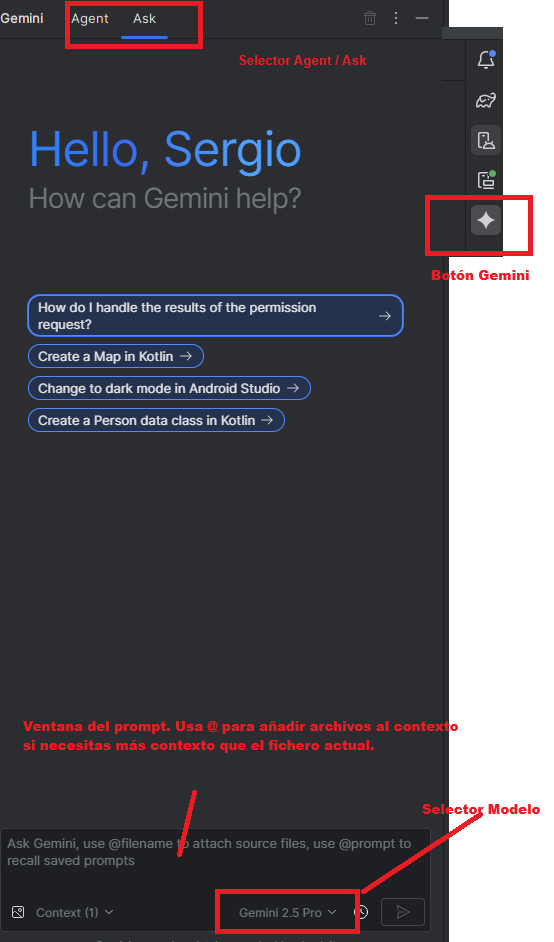
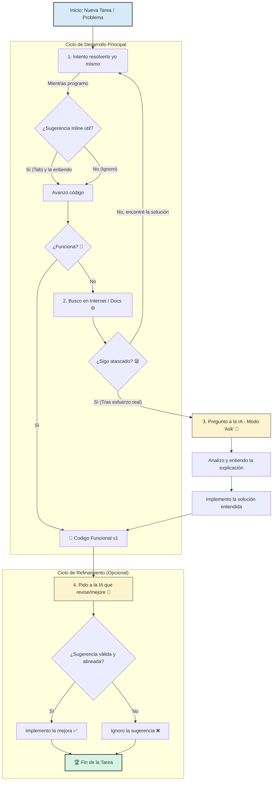

# Programación Multimedia y Dispositivos Móviles 2025

## Créditos

El material del curso es una adaptación personal del material original del profesor **Jose Antonio López de Merlo**. ¡Muchas gracias por compartirlo!

## Uso legítimo y ético de la IA en la asignatura de PMDM

En la asignatura de Programación Multimedia y Dispositivos Móviles (PMDM), se permite el uso de herramientas de inteligencia artificial (IA) para apoyar el aprendizaje y la resolución de problemas, siempre que se utilicen de manera ética y responsable. A continuación, se detallan las directrices para el uso legítimo de la IA en esta asignatura.

### Nuestro objetivo

En esta asignatura (y en vuestra carrera) el objetivo no es "entregar código que funcione". El objetivo es **convertiros en desarrolladores competentes y crecer como profesionales**: profesionales que entienden lo que hacen, por qué lo hacen y son capaces de razonar sobre su propio código o el de sus pares.

La Inteligencia Artificial es la herramienta más potente que ha llegado a nuestra profesión en décadas. Usada correctamente, os hará más productivos y os ayudará a aprender más rápido. Usada incorrectamente, **secuestrará vuestra oportunidad de aprender**. Es precisamente esta tentación su mayor riesgo y peligro.

Este documento no es para prohibir la IA; es para enseñaros a usarla como lo haría un profesional senior. Nótese que esto también pasaba antes de la IA, copiando y pegando código de StackOverflow o GitHub sin entenderlo, pero ahora es mucho más fácil caer en esa trampa.

*No queremos ser monos copiando y pegando código y cruzando los dedos para que funcione. Queremos ser desarrolladores productivos y competentes que sabemos lo que hace nuestro código.*

### Directrices para el uso legítimo de la IA

* **Como un "Autocompletar" avanzado, el modo copiloto:**
    Trabaja con la **finalización de código inline** activada. Si te sugiere exactamente lo que ibas a escribir (y lo entiendes), dale a `Tab`. Has ahorrado 5 segundos. Si no es lo que buscas o no entiendes la sugerencia, ignórala (o investígala) y sigue escribiendo. **Tú tienes el control del código que escribes.**

* **Como último recurso, no el primero:**
    El aprendizaje real ocurre cuando te atascas. **Inténtalo primero tú**. Dibuja el problema, busca en Google, consulta la documentación oficial. Si después de un esfuerzo razonable sigues atascado, pregúntale a la IA. Usarla como desbloqueador es inteligente; usarla para evitar pensar es contraproducente. También te puede ayudar a encontrar ese typo escribiendo que no ves, el paréntesis mal balanceado, la coma que falta, etc.

* **Como un Revisor de Código (Code Reviewer):**
    ¿Ya tienes tu código funcionando? ¡Genial! Ahora, pregúntale a la IA: *"¿Hay algo que pueda mejorar en este código? ¿Es eficiente? ¿Sigue las buenas prácticas de Kotlin?"*. Analiza sus sugerencias y aplica **solo aquellas que tengan sentido para ti** y para los objetivos de la práctica. La IA no siempre tiene la razón o el contexto completo.

* **Como Asistente de Documentación:**
    Una vez que tu código esté listo, puedes pedirle ayuda para documentarlo. PERO, tu responsabilidad es añadir el **"porqué"** (la intención de diseño), no solo el "qué".
  * **IA (El "Qué"):** `// Función que suma dos enteros.`
  * **Tú (El "Porqué"):** `// Usamos un Long para evitar un overflow si la suma es muy grande.`

* **Priorizando el "Por qué" (Modo "Ask"):**
    Siempre será mejor usar el modo "Preguntar" (Ask) que el modo "Agente" (Agent/Do it for me). Que la IA te **explique paso a paso** cómo refactorizar una función es mil veces más valioso para ti que pulsar un botón y que lo haga mágicamente sin que entiendas qué ha cambiado.

* **Dándole el Contexto Adecuado:**
    La IA no es adivina. Si le preguntas algo sin contexto, te dará una respuesta genérica. Usa la función `@` (por ejemplo, `@file:MiArchivo.kt`) para añadir al *prompt* los archivos específicos con los que estás trabajando. Así, su respuesta será relevante para tu proyecto.

---

### 3. 🚫 La Línea Roja: Lo que NUNCA Debes Hacer

Solo hay una regla inquebrantable, y es la más importante:

> **Bajo ningún concepto "planches el enunciado" en la IA y pegues la salida sin entender lo que te da.**

Hacer esto es el equivalente académico y profesional a rendirse.

**¿Por qué es tan grave?**

1. **Secuestra tu aprendizaje:** Te roba la oportunidad de desarrollar tu lógica, tu capacidad de análisis y tu habilidad para depurar.
2. **Genera "Código Zombie":** Producirás código que no entiendes. Si falla (y fallará), no sabrás arreglarlo. Si te piden modificarlo, no sabrás por dónde empezar.
3. **Atrofia tus habilidades:** Te vuelves dependiente. El "músculo" de resolver problemas se debilita si nunca lo usas.
4. **Nos vuelve invisibles:** Si no entiendes el código que has producido, te será muy difícil defenderlo o discutirlo con otros. La falta de comprensión te deja vulnerable a críticas y te impide aprender de tus errores. También te hace temeroso de proponer cambios o mejoras, ya que no te sentirás seguro de cómo afectarán al sistema en su conjunto. No crecerás como profesional.

---

### 4. Como usarla en Android Studio

No hay necesidad de sufrir copiando y pegando retales de código en chatGPT, Android Studio lo tiene ya integrado.

Aquí tienes unas instrucciones sencillas:

> [!WARNING]
> Aviso a navegantes: En el examen no hay internet, por lo que no podréis usar la IA. Este documento es para las prácticas y el aprendizaje.

---

### 5. Conclusión

La IA es una herramienta, no un sustituto de tu cerebro. Trátala como el asistente increíblemente rápido pero que necesita dirección que es.

El desarrollador eres tú. La responsabilidad es tuya. El aprendizaje es tuyo.

---
