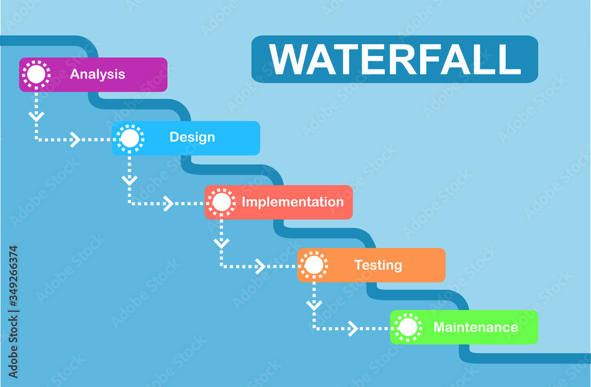
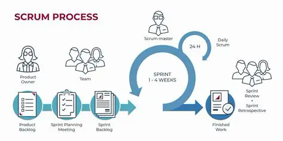
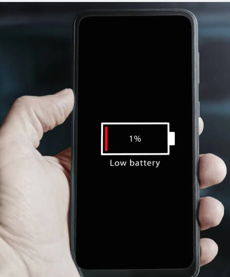
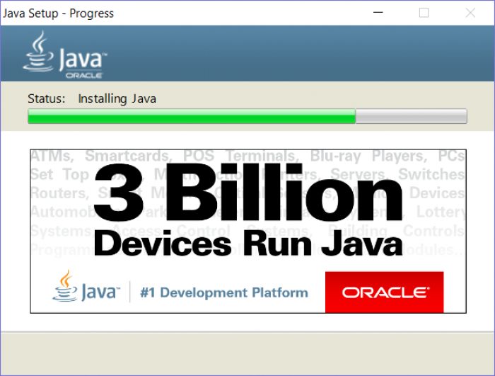
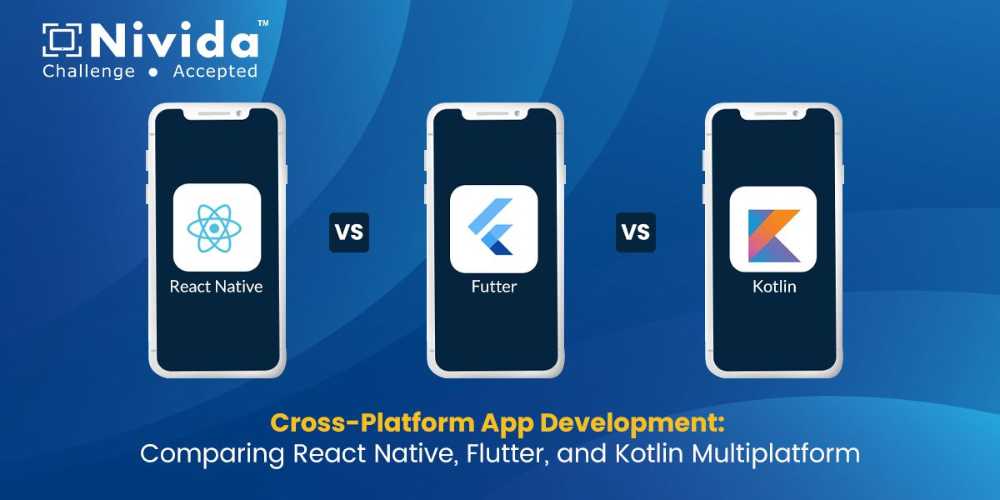

# T01-Tecnologías para aplicaciones en dispositivos móviles

## Índice

* [Desarrollo de aplicaciones Móviles – Metodologías de desarrollo](#desarrollo-de-aplicaciones-móviles--metodologías-de-desarrollo)
  * [Modelo en Cascada (Waterfall)](#modelo-en-cascada-waterfall)
  * [Metodologías Ágiles (Scrum)](#metodologías-ágiles-scrum)
  * [El Híbrido "Scrummerfall" y similares](#el-híbrido-scrummerfall-y-similares)
* [Limitaciones que plantea la ejecución de aplicaciones en dispositivos móviles](#limitaciones-que-plantea-la-ejecución-de-aplicaciones-en-dispositivos-móviles)
  * [1. La Gestión de Recursos: Ser un buen compañero](#1-la-gestión-de-recursos-ser-un-buen-compañero)
  * [2. La Arquitectura del Procesador: Un Mundo Diferente](#2-la-arquitectura-del-procesador-un-mundo-diferente)
  * [3. La Conectividad Intermitente](#3-la-conectividad-intermitente)
  * [4. Un Entorno de Alta Vulnerabilidad](#4-un-entorno-de-alta-vulnerabilidad)
  * [5. El Laberinto de la Fragmentación](#5-el-laberinto-de-la-fragmentación)
  * [6. La Batalla por la Relevancia](#6-la-batalla-por-la-relevancia)
* [Tecnologías disponibles](#tecnologías-disponibles)
  * [Clasificación Arquitectónica de las Tecnologías de Desarrollo Móvil](#clasificación-arquitectónica-de-las-tecnologías-de-desarrollo-móvil)
  * [Tabla Comparativa de Estrategias de Desarrollo Móvil](#tabla-comparativa-de-estrategias-de-desarrollo-móvil)
* [¿Qué Estudiaremos en Este Módulo?](#qué-estudiaremos-en-este-módulo)
  * [¿Por qué Nativo con Kotlin?](#por-qué-nativo-con-kotlin)
  * [Menciones de Honor, a Flutter y Kotlin Multiplatform (KMP)](#menciones-de-honor-a-flutter-y-kotlin-multiplatform-kmp)
* [Conclusión](#conclusión)

## Desarrollo de aplicaciones Móviles – Metodologías de desarrollo

El desarrollo de aplicaciones móviles, como cualquier proyecto de software, sigue una serie de etapas bien definidas. Sin embargo, no existe un único camino; la metodología "elegida" (a veces impuesta) depende del tipo de proyecto, el cliente y la cultura de la empresa.

El desarrollo de aplicaciones móviles, como proyecto de software complejo, comparte las mismas etapas fundamentales que cualquier otro; la diferencia clave reside en la **metodología** que se elige para estructurar y organizar dichas etapas, distinguiendo así los siguientes enfoques:

### Modelo en Cascada (Waterfall)

Es el enfoque tradicional y **secuencial**. Las fases del proyecto (análisis, diseño, desarrollo, pruebas, despliegue) ocurren una detrás de otra, y no se puede avanzar a la siguiente sin haber completado la anterior. Aunque fue un estándar, hoy es poco práctico para el desarrollo móvil por su rigidez y su incapacidad para adaptarse a los cambios rápidos que exige el mercado.

**Reflexión:**

* ¿Qué problemas identificáis en el modelo en cascada para el desarrollo de una app móvil?
* A pesar de sus inconvenientes, ¿qué ventaja fundamental creéis que podría ofrecer este modelo en la gestión de un proyecto?

### Metodologías Ágiles (Scrum)

Este es el enfoque **iterativo e incremental**, y el estándar de facto en el desarrollo móvil. En lugar de un único gran lanzamiento, el trabajo se divide en ciclos cortos llamados **Sprints** (de 1 a 4 semanas), al final de los cuales se entrega una versión funcional del software. Esto permite lanzar un **Producto Mínimo Viable (MVP)** rápidamente en las tiendas de aplicaciones y mejorarlo continuamente con el feedback real de los usuarios.

**Reflexión:**

* Si una gran empresa os contrata para desarrollar una app con un presupuesto cerrado, ¿qué conflicto surge al aplicar Agile y cómo lo gestionaríais?
* Si Agile puede parecer un 'cheque en blanco' para el cliente, ¿qué argumentos usaríais para convencerle de sus ventajas frente a la aparente seguridad de un presupuesto cerrado?
* ¿Cómo evita el equipo que el cliente añada funcionalidades sin control en cada sprint, desvirtuando el proyecto y los plazos?
* En Agile, si el alcance es flexible, ¿cómo demostramos al cliente que el proyecto es un éxito y que su inversión está siendo rentable?

### El Híbrido "Scrummerfall" y similares

Este modelo híbrido nace de la colisión entre equipos de desarrollo ágiles y grandes organizaciones cliente con procesos muy rígidos. Combina una fase inicial de análisis y diseño muy definida (propia de Waterfall) con fases de desarrollo y pruebas que se ejecutan en Sprints (al estilo Scrum). Es un escenario muy común en grandes consultoras, y aunque no es "Agile puro", es una realidad pragmática del sector que debéis conocer, ya que es harto probable que lo acabéis viviendo.

Otro híbrido popular es **"Scrumban"**, que mezcla la estructura de roles y reuniones de Scrum con la flexibilidad y el flujo de trabajo continuo de Kanban. En lugar de Sprints con una duración fija, el equipo trabaja sobre un tablero Kanban, moviendo tareas de una columna a otra a medida que se completan. Este enfoque es ideal para proyectos con prioridades muy cambiantes o para equipos que combinan el desarrollo de nuevas funcionalidades con el mantenimiento y la resolución de incidencias urgentes.

Nótese que términos como "**Scrummerfall**" pueden ser peyorativos, pero representan el hecho de que la realidad es tozuda y muchas veces toca acomodar soluciones de compromiso para que el trabajo salga adelante.

**Reflexión:**

* Viendo que estos modelos no son "ni una cosa ni la otra", ¿qué problemas del mundo real creéis que intentan solucionar los enfoques híbridos?
* Un equipo que intenta trabajar con Sprints (Agile) dentro de una organización que exige un plan cerrado con meses de antelación (Waterfall) puede sufrir mucha frustración. ¿Qué conflictos o tensiones creéis que pueden surgir entre los desarrolladores y la gerencia en un entorno así?

## Limitaciones que plantea la ejecución de aplicaciones en dispositivos móviles

Desarrollar para móviles no es como hacerlo para un servidor o un ordenador de sobremesa. El entorno móvil presenta un conjunto único de desafíos que debemos conocer y mitigar desde la primera línea de código. No son meras limitaciones, sino las reglas del juego que definen una aplicación de calidad.

### **1. La Gestión de Recursos: Ser un buen compañero**

A diferencia de un PC, un dispositivo móvil funciona con una **batería limitada** y debe compartir memoria y procesador con muchas otras apps. Los sistemas operativos modernos (iOS y Android) son extremadamente agresivos para preservar esa autonomía, llegando a "matar" procesos en segundo plano que consumen demasiado. Nuestra aplicación debe comportarse como un buen "compañero" del sistema: optimizar el código para minimizar el consumo de CPU, gestionar la memoria de forma eficiente y usar las APIs correctas para tareas en segundo plano.

*Pregunta de reflexión: Piensa en una app que hayas desinstalado porque era lenta o agotaba tu batería. ¿Qué te dice eso sobre la tolerancia del usuario ante un mal rendimiento?*

### **2. La Arquitectura del Procesador: Un Mundo Diferente**

Un ordenador de sobremesa o portátil suele usar procesadores con arquitectura **x86/x64**, basados en un juego de instrucciones complejo (**CISC**). Son como una navaja suiza muy avanzada, capaz de realizar tareas complejas en una sola instrucción. En cambio, los móviles utilizan mayoritariamente la arquitectura **ARM**, basada en un juego de instrucciones reducido (**RISC**), que prioriza la ejecución de muchas instrucciones muy simples y rápidas, optimizando al máximo la **eficiencia energética**.

Aunque como desarrolladores no escribimos directamente en ensamblador, entender esta diferencia es clave. Un código limpio y optimizado, que descompone las tareas en pasos sencillos, se alineará mucho mejor con la filosofía del hardware para el que estamos programando, resultando en una app más fluida y que consume menos batería.

### **3. La Conectividad Intermitente**

Un móvil está en constante movimiento, pasando de una red Wi-Fi de alta velocidad a 5G, 4G, o a una **desconexión total** al entrar en un túnel. Una aplicación que asume una conexión estable está destinada a fallar, creando una experiencia de usuario frustrante. Por ello, debemos diseñar con una mentalidad **offline-first**: guardar datos en local (caché) para que la app siga siendo funcional sin conexión y sincronizar la información cuando la conexión se restablezca.

*Pregunta de reflexión: ¿Qué esperas que haga una app como Spotify o Google Maps cuando pierdes la cobertura? ¿Cómo impacta en tu experiencia que siga funcionando o que se bloquee por completo?*

### **4. Un Entorno de Alta Vulnerabilidad**

Los móviles son inherentemente más inseguros: se conectan a redes Wi-Fi públicas, el usuario puede instalar apps de orígenes dudosos y el dispositivo físico puede ser robado. La seguridad, por tanto, no es una opción, sino una obligación. Debemos aplicar el **principio de mínimo privilegio** (solicitar solo los permisos estrictamente necesarios) y **cifrar toda la información sensible**, tanto la que se almacena en el dispositivo como la que se transmite por la red, usando siempre HTTPS.

*Pregunta de reflexión: Al instalar una app, ¿sueles revisar la lista de permisos que solicita? ¿Qué te hace desconfiar de una aplicación en este aspecto?*

### **5. El Laberinto de la Fragmentación**

No existe "un" móvil Android; existen miles de modelos con diferentes tamaños de pantalla, resoluciones, procesadores y versiones del sistema operativo. Esta **fragmentación** es un enorme desafío, ya que una interfaz que se ve perfecta en un dispositivo puede estar rota en otro.

La solución es crear interfaces de usuario **adaptables (responsive)** que se ajusten a cualquier pantalla y programar de forma defensiva, comprobando siempre la versión del SO antes de usar una función específica y ofreciendo alternativas para las más antiguas.

### **6. La Batalla por la Relevancia**

El espacio en el móvil de un usuario es un terreno muy cotizado y la gente es reacia a instalar nuevas aplicaciones si no ven un valor claro. Nuestra app compite contra la saturación, el consumo de datos de la descarga y el espacio de almacenamiento que ocupará. Por ello, debe ofrecer un **valor añadido innegable** que justifique su instalación frente a una web móvil (p. ej., acceso al hardware, notificaciones avanzadas, mejor rendimiento) y debemos optimizar al máximo su tamaño para que la descarga sea lo más ligera posible.

-----

## Tecnologías disponibles

En el desarrollo de aplicaciones móviles, han surgido diversas tecnologías para adaptarse a las necesidades de cada proyecto. Tradicionalmente, los creadores de los sistemas operativos (como Android e iOS) definen un lenguaje y un entorno de desarrollo específicos para su plataforma, lo que se conoce como **desarrollo nativo**. Sin embargo, en los últimos años han ganado popularidad diversos *frameworks* que permiten el **desarrollo multiplataforma**, facilitando la creación de aplicaciones para diferentes sistemas operativos a partir de una base de código compartida.

*El siguiente vídeo ofrece un resumen claro de las opciones actuales:*
[https://www.youtube.com/watch?v=-pWSQYpkkjk](https://www.youtube.com/watch?v=-pWSQYpkkjk)

### **Clasificación Arquitectónica de las Tecnologías de Desarrollo Móvil**

Para analizar las distintas estrategias de desarrollo de aplicaciones móviles, es fundamental clasificarlas según cómo el código de la aplicación interactúa con el sistema operativo y cómo se renderiza la interfaz de usuario. Así, distinguimos tres paradigmas fundamentales:

**1. Desarrollo Nativo**
Consiste en la utilización del **Software Development Kit (SDK)** oficial, el lenguaje de programación y el paradigma de diseño estipulado por el proveedor de la plataforma. Este enfoque garantiza el acceso directo y de máximo rendimiento a todas las APIs del sistema operativo y las capacidades del hardware. El resultado es una aplicación que ofrece la mayor fidelidad en términos de rendimiento, comportamiento y estética (UI/UX) con respecto a la plataforma de destino.

* **Android 🤖:**
  * **Lenguajes:** **Kotlin** (recomendado oficialmente) y Java (legacy).
  * **Entorno de Desarrollo (IDE):** Android Studio.
* **iOS (iPhone) 🍏:**
  * **Lenguajes:** **Swift** (para las aplicaciones modernas) y Objective-C (legacy).
  * **Entorno de Desarrollo (IDE):** Xcode.

En un proyecto nativo que se plantease para ambas plataformas, supondría **dos bases de código completamente separadas**. Esto implica que el flujo de trabajo, las versiones y los repositorios en el control de versiones (como Git) se gestionan de manera independiente.

**Ventajas clave del desarrollo nativo:**

* ✅ **Máximo Rendimiento:** Son las aplicaciones más rápidas, eficientes y que mejor gestionan la batería y la memoria.
* ✅ **Acceso Total:** Tienen acceso inmediato y completo a todas las novedades del sistema operativo y del hardware (cámaras, sensores, etc.).
* ✅ **Seguridad y Soporte:** Cuentan con el soporte directo de Apple y Google, garantizando la máxima seguridad y estabilidad.
* ✅ **Experiencia de Usuario (UX) Perfecta:** Se integran visualmente a la perfección con el sistema, ofreciendo la experiencia a la que el usuario está acostumbrado.

**2. Estrategias Multiplataforma**
Este es un término paraguas que engloba a todas las tecnologías cuyo objetivo es maximizar la reutilización de código a través de diferentes sistemas operativos. Un **mismo código y lenguaje de programación** puede compilarse para ejecutarse en dos o más plataformas diferentes, buscando un ahorro de tiempo y recursos. En este caso, gestionamos un **único proyecto** para todas las plataformas. Es un enfoque similar al Java "Write Once, Run Anywhere" (WORA) de hace años, pero adaptado a las necesidades y limitaciones del entorno móvil.Sin embargo, se subdividen en arquitecturas muy diferentes:

* **a) Enfoque Híbrido (Basado en `WebView`):** La aplicación se construye utilizando tecnologías web estándar (HTML, CSS, JavaScript) y se empaqueta dentro de un contenedor nativo. Este contenedor expone un componente `WebView` (un motor de navegador sin chrome) que renderiza la aplicación. La comunicación con las funcionalidades nativas del dispositivo (cámara, GPS) se realiza a través de un "puente" de JavaScript.
  * *Ejemplos representativos:* Apache Cordova, Ionic.
  * Recurso adicional: [What, When, Where, How WebView? | BitBuddy](https://www.youtube.com/watch?v=GHLETeVh3ps)

* **b) Enfoque Compilado o con Renderizado Nativo:** El código fuente, escrito en un lenguaje no nativo, se traduce a elementos nativos en tiempo de compilación o se utiliza un motor de renderizado de alto rendimiento para dibujar la interfaz directamente sobre un canvas de la plataforma. Este paradigma evita el cuello de botella de rendimiento de la `WebView`.
  * **Compilado a Widgets Nativos:** El framework actúa como un traductor que convierte los componentes de UI definidos en el código (p. ej., en JavaScript) a sus equivalentes 100% nativos en cada plataforma. *Ejemplo representativo:* React Native.
  * **Renderizado Propio:** El framework incluye su propio motor gráfico que se encarga de "pintar" cada píxel de la interfaz de usuario. Esto ofrece una consistencia visual máxima entre plataformas. *Ejemplo representativo:* Flutter (con su motor Skia).

**3. Aplicaciones Web Móviles y Progresivas (PWA)**
Esta categoría opera fundamentalmente dentro del **sandbox del navegador web** y no requiere instalación a través de una tienda de aplicaciones.

* **a) Aplicación Web Móvil (WebApp):** Es un sitio web con un diseño *responsive* que se adapta a las pantallas de los dispositivos móviles. Su funcionalidad está intrínsecamente ligada a la del navegador y requiere una conexión a internet activa.

* **b) Aplicación Web Progresiva (PWA):** Es una evolución de la WebApp que utiliza APIs modernas del navegador (como *Service Workers* y el *Web App Manifest*) para proporcionar una experiencia similar a la de una aplicación nativa. Ofrece capacidades como el funcionamiento sin conexión, notificaciones push y la posibilidad de ser "añadida a la pantalla de inicio". Aunque una PWA puede ser encapsulada en una *Trusted Web Activity (TWA)* para su distribución en la Google Play Store, su arquitectura fundamental sigue residiendo y ejecutándose en el entorno del navegador, lo que la sitúa en la frontera entre una WebApp avanzada y una aplicación híbrida. El gran problema de las PWAs es su **baja descubribilidad**. El aviso de "Añadir a pantalla de inicio" es a menudo ignorado o no entendido por los usuarios, que están acostumbrados al modelo centralizado de las App Stores para descubrir e instalar aplicaciones.
  * Recurso Adicional: [Installing a PWA](https://www.youtube.com/watch?v=iJteraObjgs)

### **Tabla Comparativa de Estrategias de Desarrollo Móvil**

| Característica 📋 | Aplicaciones Nativas 👑 | Aplicaciones Multiplataforma 🛠️ | Aplicaciones Web Progresivas (PWA) 🌐 | Web Responsive 🖥️ |
| :--- | :--- | :--- | :--- | :--- |
| **Rendimiento** 🚀 | ⭐⭐⭐⭐⭐ **Máximo** | ⭐⭐⭐⭐ **Medio-Alto** | ⭐⭐ **Bajo** | ⭐ **Bajo** (depende del navegador) |
| **Acceso a Novedades del SO** ✅ | ✅ **Inmediato** | ❌ **Con retraso** | ❌ **N/A** (no depende del SO) | ❌ **N/A** |
| **Coste y Tiempo** 💰⏰ | 🔴 **Alto** | 🟡 **Medio** | 🟢 **Bajo** | 🟢 **Muy Bajo** |
| **Experiencia de Usuario (UX)** 👍 | 👍 **Perfecta** | 🤔 **Un reto** | 🙂 **Buena** (app-like) | 😐 **Básica** (es una web) |
| **Escalabilidad** | 🚀 **Infinita** | ⚠️ **Cuidado** | ✅ **Alta** (escalabilidad web) | ✅ **Alta** (escalabilidad web) |
| **Distribución (App Stores)** 🛍️ | ✅ **Sí** | ✅ **Sí** | 🤏 **Parcial** (vía TWA) | ❌ **No** |
| **Acceso al Dispositivo** 📸 | ✅ **Completo** | 👍 **Alto/Completo** | 🤏 **Parcial** | ⛔ **Muy Limitado** |
| **Necesita Conexión** 📶 | 😌 **No siempre** | 😌 **No siempre** | 🙂 **Parcialmente** (offline-first) | ⚠️ **Siempre** |
| **Curva de Aprendizaje** 🧠 | 🧗 **Alta** | 🏃 **Media** | 🚶 **Baja** | 🚶 **Muy Baja** (tecnología web estándar) |
| **Caso de uso típico** 🎯 | Apps muy exigentes (juegos, editores), que requieran la máxima integración y rendimiento. | Proyectos con presupuesto/tiempo limitado (MVP), apps de negocio, o donde la UI es muy personalizada. | Herramientas internas, e-commerce, apps de noticias. Cuando se quiere una 'app' sin pasar por las stores. | Blogs, webs corporativas, landing pages. Presencia online básica y accesible para todos. |

-----

## ¿Qué Estudiaremos en Este Módulo?

Como vimos el día de la presentación, el abanico de tecnologías es muy amplio. En este curso, nos centraremos en aprender a desarrollar **aplicaciones nativas para el sistema operativo Android con el lenguaje Kotlin**.

### ¿Por qué Nativo con Kotlin?

1. **Base Fundamental:** Aprender desarrollo nativo te proporciona los cimientos más sólidos. Entenderás cómo funciona realmente el sistema operativo, la gestión de recursos, el ciclo de vida de una app y las guías de diseño oficiales.

2. **Demanda de Mercado:** Sigue habiendo una gran demanda de desarrolladores nativos puros, especialmente para aplicaciones de alto rendimiento y de grandes empresas.

3. **La Tendencia de Kotlin y el Estado de KMP:** Kotlin es el lenguaje preferido para Android y la base de **Kotlin Multiplatform (KMP)**.

### Menciones de Honor, a Flutter y Kotlin Multiplatform (KMP)

#### **¿Qué es Flutter?**

Flutter es la tecnología multiplataforma creada por Google que está ganando más popularidad. ¡Es de código abierto y tiene una comunidad enorme!

Para entender cómo funciona Flutter, necesitamos conocer sus tres pilares:

* **Dart:** Es el lenguaje de programación, también creado por Google. Una de sus grandes ventajas es el **Hot Reload**, que nos permite ver los cambios en la app casi al instante sin tener que reiniciarla.
* **Skia:** Es el motor de renderizado 2D. En lugar de usar los botones o textos nativos de iOS o Android, Skia los *dibuja* por su cuenta en la pantalla. Esto garantiza que la app se vea (casi) igual en todas partes.
* **Widgets:** En Flutter, todo es un widget. Un botón es un widget, un texto es un widget, ¡incluso la forma de centrar algo en la pantalla es un widget! Esto nos permite construir interfaces complejas combinando piezas simples.

**¿Cuándo Debería Usar Flutter?:**

Flutter es una alternativa fantástica y, según muchos, **la mejor opción multiplataforma que tenemos hoy**. Es una excelente elección para:

* **Startups y MVPs (Productos Mínimos Viables):** Para lanzar una aplicación rápidamente en ambos mercados con un presupuesto limitado.
* **Aplicaciones con Interfaces Personalizadas:** Donde no se busca imitar al 100% el look nativo.
* **Proyectos con Lógica de Negocio Compartida:** Apps donde la mayor parte del código no es visual y se puede compartir fácilmente.

**La experiencia importa:** Los desarrolles multiplataforma con la experiencia y en particular los buenos, son aquellos que también **entienden cómo funcionan los sistemas nativos**. Conocer las bases de iOS y Android te dará una ventaja competitiva enorme, incluso si te especializas en Flutter.

#### KMP - Kotlin Multiplatform. Estado Actual de Kotlin Multiplatform (KMP)

KMP ha alcanzado una fase **estable y está listo para producción**. Google y JetBrains están invirtiendo fuertemente en él. Su enfoque es diferente al de Flutter: **KMP se centra en compartir la lógica de negocio (acceso a datos, red, etc.), pero la interfaz de usuario (UI) se construye de forma nativa en cada plataforma (con Jetpack Compose en Android y SwiftUI en iOS)**.

* **Adopción:** Está creciendo de manera constante, especialmente en empresas que ya tienen equipos nativos de Android e iOS y buscan unificar la lógica sin sacrificar la UI nativa. Empresas como **Netflix, VMWare y Forbes** ya lo usan en producción.
* **¿Ha despegado?** Aún no tiene la cuota de mercado de Flutter o React Native, pero su crecimiento es sólido y se considera una apuesta de futuro muy seria, sobre todo para proyectos que exigen una UI 100% nativa.

Actualización 2025: KMP sigue ganando tracción. Al nivel 1 - lógica de negocio compartida - se ha unido el nivel 2 - UI compartida - con librerías como **Kotlin/Compose Multiplatform** que permiten compartir componentes de UI entre Android, iOS, escritorio y web. Aunque aún no es tan maduro como Flutter, la comunidad y el ecosistema están creciendo rápidamente. Compose Multiplatform ya está disponible para iOS en multiplataforma en release estable, y para web se espera que alcance la beta durante este año.
[KotlinConf'25 Keynote](https://www.youtube.com/watch?v=Wib6pjJoFzc)

*Para saber más sobre KMP, puedes ver este vídeo:*
[https://www.youtube.com/watch?v=Wib6pjJoFzc](https://www.youtube.com/watch?v=Wib6pjJoFzc)

*Artículo recomendado:*
[https://devexperto.com/flutter-vs-kotlin/](https://devexperto.com/flutter-vs-kotlin/)

-----

### Conclusión

Como vemos, no hay una respuesta única. Ambas vías, **nativa** y **multiplataforma**, son válidas y tienen su lugar en la industria. Nuestro objetivo en este ciclo, tal como marcan los resultados de aprendizaje del módulo **0489 - Programación multimedia y dispositivos móviles**, es que seáis capaces de:

* **Evaluar las tecnologías disponibles** para dispositivos móviles.
* **Desarrollar aplicaciones** empleando las librerías y herramientas específicas, ya sea para móviles o para juegos 2D y 3D.
* **Integrar contenidos multimedia** y crear interfaces de usuario funcionales y atractivas.
