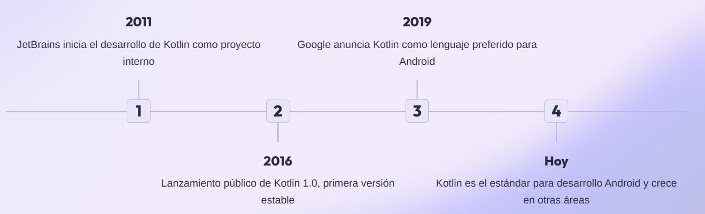
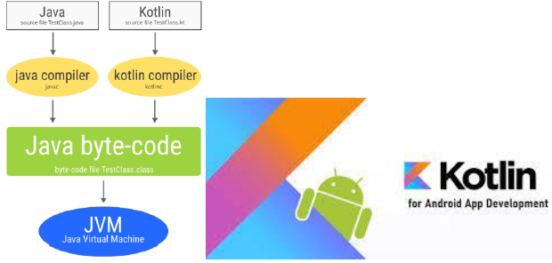
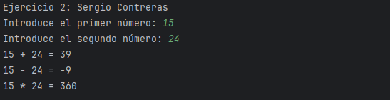

# T02-Introducción a Kotlin

## Índice

- [1. La función `main()`](#1-la-función-main)
- [2. Sacando información por pantalla: `print()` y `println()`](#2-sacando-información-por-pantalla-print-y-println)
- [3. Nomenclatura: Naming Conventions](#3-nomenclatura-naming-conventions)
- [4. Manejo de Strings](#4-manejo-de-strings)
- [5. Mutabilidad: `val` vs. `var`](#5-mutabilidad-val-vs-var)
- [6. Sistema de tipos e inferencia](#6-sistema-de-tipos-e-inferencia)
- [7. Ejercicios propuestos I 🚨](#7-ejercicios-propuestos-i-)
- [8. Flujo de Entrada y Salida (I/O)](#8-flujo-de-entrada-y-salida-io)
- [9. Variables `val` y `var` Profundizando](#9-variables-val-y-var-profundizando)
- [10. Tipos de Datos: ¿Primitivos o no?](#10-tipos-de-datos-primitivos-o-no)
- [11. Arrays y Strings](#11-arrays-y-strings)
- [12. Conversión de Tipos (Casting)](#12-conversión-de-tipos-casting)
- [13. Fundamentos - Lecturas obligatorias I](#13-fundamentos---lecturas-obligatorias-i)
- [14. Anulabilidad y Seguridad de Nulos](#14-anulabilidad-y-seguridad-de-nulos)
- [15. Ejercicios propuestos II 🚨](#15-ejercicios-propuestos-ii-)
- [16. Estructuras de Control - Lecturas obligatorias II](#16-estructuras-de-control---lecturas-obligatorias-ii)
- [17. Ejercicios Propuestos III 🚨](#17-ejercicios-propuestos-iii-)
- [18. Funciones - Lecturas obligatorias III](#18-funciones---lecturas-obligatorias-iii)
- [19. Ejercicios Propuestos IV 🚨](#19-ejercicios-propuestos-iv-)
- [20. One-liners en Kotlin](#20-one-liners-en-kotlin)
- [21. Ejercicios Propuestos V 🚨](#21-ejercicios-propuestos-v-)
- [22. Lambdas en Kotlin - Lecturas obligatorias IV](#22-lambdas-en-kotlin---lecturas-obligatorias-iv)
- [23. Ejercicios Propuestos VI 🚨](#23-ejercicios-propuestos-vi-)
- [24. Colecciones - Lecturas obligatorias V](#24-colecciones---lecturas-obligatorias-v-)
- [25. Aplicando Lambdas a Colecciones: La palanca de la Programación Funcional](#25-aplicando-lambdas-a-colecciones-la-palanca-de-la-programación-funcional)
- [26. Ejercicios Propuestos VII 🚨](#26-ejercicios-propuestos-vii-)
- [27. POO - Lecturas obligatorias VI](#27-poo---lecturas-obligatorias-vi)
- [28. Ejercicios Propuestos VIII 🚨](#28-ejercicios-propuestos-viii-)

## Kotlin Crash Course para Alumnos de Java

Kotlin apareció oficialmente en 2016, aunque su desarrollo comenzó en 2011. Este lenguaje fue creado por JetBrains, la empresa detrás del popular IDE IntelliJ IDEA, con un objetivo claro: evolucionar Java manteniendo su compatibilidad.

<p style="display: flex; align-items: center; gap: 10px;">
  
  
  
</p>

Los expertos de JetBrains se propusieron crear un lenguaje que aprovechara los 30 años de aprendizaje de Java, corrigiendo sus limitaciones y añadiendo características modernas que los desarrolladores necesitan hoy.



La adopción de Kotlin por parte de Google marcó un punto de inflexión. Esto significa que las características más novedosas y potentes de Android se desarrollan primero en Kotlin, haciendo casi imprescindible su aprendizaje para desarrolladores móviles.

**¿Por qué gusta tanto Kotlin?**:

- **Interoperabilidad Total**: Funciona perfectamente con código Java existente. Puedes migrar gradualmente sin reescribir todo tu proyecto.
- **Misma JVM**: Utiliza la Java Virtual Machine, aprovechando toda la infraestructura y librerías del ecosistema Java.



- **Sintaxis Moderna**: Código más conciso y legible que Java, con características que mejoran la productividad del desarrollador.
- **Seguridad de Tipos**: Reduce errores comunes como los `NullPointerException` con un sistema de tipos más robusto.
- **Soporte Oficial de Google**: Kotlin es un lenguaje de primera clase para Android, con soporte completo en Android Studio y nuevas APIs diseñadas para Kotlin. Bueno, aunque con Google nunca se sabe [Cementerio de Google](https://killedbygoogle.com/)... pero de momento es así.

**¿Qué IDE se recomienda para Kotlin?**:

- IntelliJ IDEA: El IDE por excelencia para Kotlin. Creado por los mismos desarrolladores del lenguaje, ofrece el mejor soporte y características avanzadas.
- Android Studio: Versión especializada de IntelliJ para desarrollo Android. Incluye todas las herramientas necesarias para crear aplicaciones móviles. ⭐ -> **Nuestra elección en este módulo debido a que nos conviene familiarizarnos todo lo posible con el IDE oficial de Android.**
- Visual Studio Code: Opción ligera con la extensión de Kotlin. Perfecto para pruebas rápidas y desarrollo básico.

**Recursos Kotlin curated** 🧀:

- [Kotlin Documentation](https://kotlinlang.org/docs/home.html): La documentación oficial es siempre el mejor lugar para empezar.
- [Kotlin Tour](https://kotlinlang.org/docs/kotlin-tour-welcome.html): Una introducción interactiva a Kotlin.
- [Guía de Kotlin by Develou](https://www.develou.com/guia-de-kotlin/): Un recurso completo para aprender Kotlin desde cero. Prácticamente te acompaña hasta la frontera de los temas intermedios-avanzados. En general nos apoyaremos en esta guía para el curso.
- [Kotlin Koans](https://kotlinlang.org/docs/koans.html): Una serie de ejercicios interactivos para aprender Kotlin de manera práctica.

[!NOTE]
> Una vez terminado el curso de Develou puedes explorar otras temáticas como: Gradle con Kotlin DSL, Coroutines (concurrencia), patrones de diseño, testing y serialization por proponer algunos campos.

¿Probamos a instalar JetBrains Academy plugin en Android Studio en los PCs del aula? --> Ya veremos si funciona, los ejercicios del curso tampoco se entienden muy bien todo sea dicho.

Otros recursos interesantes para darle duro durísimo 🌯 al coding son:

- [Exercism - Kotlin Track](https://exercism.org/tracks/kotlin): Plataforma con ejercicios prácticos y mentoría.
- [LeetCode - Kotlin Problems](https://leetcode.com/problemset/all/?difficulty=All&status=All&tags=&listId=&page=1&language=Kotlin): Problemas de algoritmos y estructuras de datos para practicar.
- [HackerRank - Kotlin Challenges](https://www.hackerrank.com/domains/tutorials/10-days-of-kotlin): Desafíos de programación en Kotlin.

### 1. La función `main()`

En **Java**, estamos acostumbrados a la verbosidad (sí, este adjetivo existe en castellano) de una clase solo para empezar:

```java
public class Main {
    public static void main(String[] args) {
        System.out.println("Hola desde Java");
    }
}
```

En **Kotlin**, la entrada es mucho más directa. Es una función de nivel superior (no necesita una clase que la contenga), lo que reduce el código "boilerplate" o repetitivo.

```kotlin
fun main() {
    println("¡Hola desde Kotlin!")
}
```

Esta filosofía es troncal al lenguaje Kotlin, que busca ser **conciso y pragmático**. Menos código para hacer lo mismo significa menos errores y más legibilidad. En general a la gente que viene de Java le encanta este enfoque.

Otros ejemplos de esta concisión del lenguaje los encontramos con los

- **Lambdas**

```java
boton.setOnClickListener(new View.OnClickListener() {
    @Override
    public void onClick(View v) {
        // Acción al hacer clic
    }
});
```

```kotlin
boton.setOnClickListener {
    // Acción al hacer clic
}
```

- **Definifición de clases**

```java
public class Persona {

    // Atributos
    private String nombre;
    private int edad;

    // Constructor
    public Persona(String nombre, int edad) {
        this.nombre = nombre;
        this.edad = edad;
    }
  
    // Getters y Setters
    public String getNombre() {
        return nombre;
    }
    public int getEdad() {
        return edad;
    }
    public void setNombre(String nombre) {
        this.nombre = nombre;
    }
    public void setEdad(int edad) {
        this.edad = edad;
    }

    // toString, hashCode, equals, copy...

    //Resto de métodos...
}
```

```kotlin
data class Persona(var nombre: String, var edad: Int)
// Resto de métodos
```

-----

### 2. Sacando información por pantalla: `print()` y `println()`

De nuevo, la simpleza es la clave. En Java imprimíamos por pantalla usando `System.out.println()`. Esto son tres niveles de jerarquía para algo tan básico como mostrar texto. Clase `System`, objeto `out` (salida estándar), método `println()`.

- En **Kotlin**, las funciones `print()` y `println()` están disponibles directamente.
- `println()` añade un salto de línea al final, mientras que `print()` no lo hace.

```kotlin
fun main() {
    print("Esto es una línea.")
    print(" Y esto sigue en la misma línea.")
    println() // Salto de línea explícito
    println("Esto aparece en una nueva línea.")
    println("Y esto en otra.")
}
```

En Kotlin, estas funciones forman parte de la librería estándar de Kotlin, que se importa por defecto en todos los ficheros `.kt`. Por eso nos ahorramos escribir `System.out...` cada vez. Sin duda una lección aprendida de esos 30 años de Java.


-----

### 3. Nomenclatura: Naming Conventions

Normalmente el tema de la nomenclatura se pasa demasiado por alto, pero desde la experiencia personal en proyectos software, es lo primero que muchos miramos para saber si podemos esperar un código profesional y mantenible o un circo de los horrores. Si la gente no ha sido capaz de seguir unas simples convenciones de nombres, ¿cómo podemos confiar en que su código sea sólido y bien estructurado? Lo mismo sucede con las faltas de ortografía en la UI, generan desconfianza sobre la calidad del producto. ¿Sí algo tan obvio se ha escapado de las pruebas, qué más puede estar mal?

Aquí puedes tranquilizarles: las convenciones son prácticamente idénticas a las de Java, lo que facilita la transición.

- **Clases e Interfaces:** `PascalCase` (ej. `MiClaseAdaptadora`).
- **Funciones y Variables:** `camelCase` (ej. `miVariable`, `calcularTotal()`).
- **Constantes:** `SNAKE_CASE` en mayúsculas (ej. `const val MAX_INTENTOS = 3`).
- **Diferencia clave con Java ‼️:** En Kotlin, el nombre del paquete (ej. `package com.ies.proyecto`) **no tiene por qué coincidir con la estructura de directorios**. Aunque es una buena práctica mantener la coherencia, no es una imposición del compilador como en Java. Normalmente de esto se encarga el IDE automáticamente, pero no está de más mencionarlo.

-----

### 4. Manejo de Strings

Aquí es donde Kotlin empieza a brillar de verdad para los que vienen de Java. Esta parte era un dolor de muelas en Java y Kotlin lo hace mucho más sencillo e intuitivo, similar a las string templates de JavaScript o Python.

- **Strings Multilínea:** En Java, crear un string multilínea es engorroso (`"línea1\n" + "línea2"`). En Kotlin, se usan las triples comillas `"""`. ¡Igual que en Python! 🐍

    ```kotlin
    // Ideal para JSON, SQL, o cualquier texto largo como menus, mensajes de ayuda, etc.
    val miJson = """
    {
        "usuario": "Juan",
        "activo": true
    }
    """
    println(miJson)
    ```

- **String Templates (Plantillas de Strings):** Mientras que en Java se concatena con `+` o se usa `String.format()`, Kotlin lo integra de forma nativa con el símbolo `$`.

    ```kotlin
    val nombre = "Ana"
    val edad = 28
    // En Java: String saludo = "Hola, me llamo " + nombre + " y tengo " + edad + " años.";
    // En Kotlin:
    val saludo = "Hola, me llamo $nombre y tengo $edad años."
    println(saludo)
    // Para expresiones más complejas, se usan llaves
    println("El año que viene, ${nombre} tendrá ${edad + 1} años.")
    ```

-----

### 5. Mutabilidad: `val` vs. `var`

Este es un cambio de paradigma fundamental respecto a Java.

- `val` (de *value*): Se usa para declarar variables **inmutables** (solo lectura). Es el análogo al `final` de Java. Una vez asignado un valor, no se puede reasignar.

```kotlin
val nombre = "María"
// nombre = "Lucía" // Error de compilación: Val cannot be reassigned
// en Java sería: final String nombre = "María";
```

- `var` (de *variable*): Se usa para variables **mutables**, cuyo valor puede cambiar.

```kotlin
var contador = 0
contador += 1 // Correcto
```

```kotlin
val nombreCompleto = "Carlos" // No se puede reasignar, pero el objeto al que apunta podría ser mutable. En cualquier caso, String es inmutable en Kotlin (igual que en Java).
var edadActual = 22
// nombreCompleto = "Luis" // Error de compilación: Val cannot be reassigned
edadActual = 23 // Correcto
```

En la medida de lo posible utilizar `val` como buena práctica para prevenir errores. Si intentamos reasignar un `val`, el compilador nos avisará inmediatamente.

-----

### **6. Sistema de tipos e inferencia**

Este es un tema que merece un poco más de atención porque hay importantes diferencias entre los lenguajes de programación. Si bien en este curso nos centraremos en Kotlin, no es raro que a lo largo de vuestra carrera profesional os toque trabajar con distintos lenguajes, frameworks y paradigmas (ya sabéis... adaptarse o morir).

[Popularidad de los lenguajes de programación](https://www.youtube.com/watch?v=ZTPrbAKmcdo)

#### Tipado dinámico vs. estático

- **Dinámico** → El tipo se asocia al valor y se comprueba **en tiempo de ejecución**. Una variable puede cambiar de tipo durante la ejecución.  
  Ej.: Python:  

  ```python
  x = 5       # int
  x = "hola"  # str 
  ```

- **Estático** → El tipo se asocia a la variable y se comprueba **en tiempo de compilación**. Una variable no puede cambiar de tipo en compilación. No puedes reasignar un tipo distinto.  
  Ej.: Kotlin / Java:  

  ```kotlin
  var x: Int = 5
  x = "hola" // ❌ Error de compilación
  ```

-----

##### Tipado fuerte vs. débil

- **Fuerte** → No permite mezclar tipos incompatibles sin conversión explícita.  
  Ej.: Python y Kotlin:  

  ```python
  5 + "7"  # ❌ TypeError
  ```

- **Débil** → Hace conversiones implícitas para que la operación funcione.  
  Ej.: JavaScript:  

  ```javascript
  5 + "7" // "57" (convierte implícitamente el número a string)
  ```

El caso de JavaScript es paradigmático con la de comportamientos inesperados. Midudev hace frecuentemente tests en instagram sobre esto y son complicados si no estas muy en el mindset de JavaScript.

-----

**🔍 Cuadro resumen:**

| Lenguaje  | Dinámico/Estático | Fuerte/Débil | ¿Inferencia de tipos? |
|-----------|-------------------|--------------|-----------------------|
| **Python** | Dinámico          | **Fuerte** | Sí (a partir del valor asignado) |
| **Kotlin** | Estático          | Fuerte       | Sí (muy potente con `val`/`var`) |
| **Java**   | Estático          | Fuerte       | Sí, desde Java 10 con `var` (antes no) |

Ojo que todavía mucho code legacy de Java es de Java 8 o anterior, donde no existía `var` y la inferencia de tipos era muy limitada. Muchos venimos de ahí y arrastramos esa fosilización mental.

```kotlin
// Inferencia de tipos (el compilador sabe que son String e Int)
val mensaje = "Bienvenida a PMDM"
var anno = 2025

// Tipado explícito (a veces necesario o preferible por claridad)
val notaFinal: Double = 9.5
var profesor: String = "Profesor Sergio"
```

En Kotlin, los literales enteros son `Int` por defecto y los literales con decimales son `Double` por defecto.  

```kotlin
val numeroEntero = 42        // Int por defecto
val numeroDecimal = 3.14     // Double por defecto
```

Si queremos `Long` o `Float`, debemos indicarlo explícitamente, ya sea con anotación de tipo o usando los sufijos `L` (para `Long`) o `f`/`F` (para `Float`).  

En el caso de `Byte` y `Short`, no existen sufijos de literal, por lo que siempre hay que indicarlos de forma explícita mediante anotación de tipo o conversión (`toByte()`, `toShort()`).

Insistir que la inferencia de tipos no hace que Kotlin sea "débilmente tipado" como Python o JavaScript. El tipo sigue estando ahí, es inmutable y se comprueba en compilación, lo que nos da la seguridad de Java con la verbosidad reducida de un lenguaje de scripting.

### 7. Ejercicios propuestos I 🚨

#### Ejercicio 0: Setup del entorno

1. Instala Android Studio (si no lo tienes ya).
2. Crea un nuevo proyecto Android con una Activity vacía.
3. Añade un nuevo fichero Kotlin (por ejemplo `EjerciciosT02` o `Main.kt`) en el directorio.
4. Crea un repo privado en GitHub dentro de tu organización de Móvil 2025.
5. Configura el remote, la autenticación.

#### Ejercicio 1: Hola Mundo en Kotlin

1. En el fichero `Main.kt`, escribe la función `main()` esta llamara a una función ejercicio1() que deberás definir a continuación.
2. Dentro de `ejercicio1()`, utiliza `println()` para mostrar "Hola, soy [tu nombre completo] y este es mi primer programa en Kotlin".
3. Llama a `ejercicio1()` desde `main()`.
4. Ejecuta el programa, si todo está correcto haz un commit y push a tu repo de GitHub.

#### Ejercicio 2: Variables y Tipos

Crea un programa en Kotlin que pida dos números al usuario y muestre por pantalla la suma, la resta y la multiplicación. Procura que la entrada sea en la misma línea como la imagen. Por el momento no comprobamos los tipos, ve la nota abajo. Imprime primero un mensaje en el que aparezca tu nombre “Ejercicio 2: Sergio Contreras".



Empaqueta todo en una función `ejercicio2()` y llámala desde `main()`.

[!NOTE]
> Puedes usar `readln().toInt()` para leer la entrada del usuario y convertirla a un entero sin preocuparte todavía por la anulabilidad (lo veremos en detalle más adelante). Recuerda usar `val` y `var` adecuadamente.

-----

### 8. Flujo de Entrada y Salida (I/O)

Mientras que en **Java** se necesita un objeto `Scanner` para leer desde la consola, Kotlin lo simplifica enormemente.

En **Kotlin**, la función principal para leer una línea de texto desde la entrada estándar es `readln()`. Es importante destacar que `readln()` siempre devuelve un `String`, lo que nos servirá de gancho para el tema de la conversión de tipos.

[!NOTE]
> Antes de Kotlin 1.6, se usaba `readLine()`, que devolvía un `String?` (un String que podía ser nulo). Aunque `readln()` es más sencillo para empezar, es bueno que sepáis que `readLine()` sigue existiendo y es útil cuando se quiere manejar la posibilidad de entrada nula. Lo veremos más adelante.

```kotlin
fun main() {
    println("Por favor, introduce tu nombre:")
    val nombre = readln()

    println("Hola, $nombre. Ahora, introduce tu edad:")
    val edadString = readln()

    // Adelanto de la conversión de tipos
    val edad = edadString.toInt()

    println("Gracias. Has confirmado que tienes $edad años.")
}
```

Este es un excelente momento para introducir el concepto de **nulabilidad** en Kotlin. La función `readln()` lanza una excepción si no hay línea que leer, pero su predecesora `readLine()` devuelve un `String?` (un String que puede ser nulo). Esto nos servirá para entender cómo Kotlin obliga a manejar los nulos de forma segura, una de sus mayores ventajas sobre Java para evitar el famoso `NullPointerException`.

-----

### 9. Variables `val` y `var` Profundizando

Ya introdujimos `val` y `var`, pero un punto clave que confunde a los que vienen de Java es la diferencia entre **referencia inmutable y objeto inmutable**.

Un `val` declara una **referencia inmutable**, similar a `final` en Java. Esto significa que no puedes reasignar la variable para que apunte a otro objeto, pero si el objeto en sí es mutable (como una lista mutable), **su contenido sí puede cambiar**. Para poder ver esto me toca adelantarme un poco al tema de las colecciones con el código de abajo.

```kotlin
// La lista es una referencia inmutable (val)
val colores = mutableListOf("rojo", "verde", "azul")

// Esto daría un error de compilación, no podemos reasignar la variable 'colores'
// colores = mutableListOf("amarillo", "naranja")

// Pero sí podemos modificar el contenido del objeto al que apunta
colores.add("amarillo") // ¡Esto es totalmente válido!
println(colores) // Imprime [rojo, verde, azul, amarillo]
```

-----

### 10. Tipos de Datos: ¿Primitivos o no?

Esta es una de las diferencias más elegantes y simplificadoras de Kotlin respecto a Java es la siguiente: En **Java**, existen tipos primitivos (`int`, `double`, `boolean`) y sus clases envoltorio (wrapper) (`Integer`, `Double`, `Boolean`). En **Kotlin**, **todo es un objeto**. No hay distinción a nivel de código entre primitivos y sus envoltorios; usamos `Int`, `Double`, `Boolean`, etc., directamente.

```kotlin
val numero: Int = 42
// Podemos llamar a métodos directamente sobre el número, porque es un objeto.
val numeroComoString: String = numero.toString()
```

-----

### 11. Arrays y Strings

Ambos son fundamentales, y Kotlin ofrece mejoras de calidad de vida.

- **Strings:** Además de las plantillas y los strings multilínea, muchas operaciones son ahora propiedades en lugar de métodos. Por ejemplo, se usa `.length` en lugar del método `.length()` de Java. Se queda como en Python.

```kotlin
val saludo = "Hola, Mundo"
println("La longitud es: ${saludo.length}") // .length es una propiedad
```

- **Arrays:** La sintaxis de creación es más limpia. Se usan funciones de librería como `arrayOf()` para crear arrays con elementos, o `IntArray()` / `DoubleArray()` para arrays de tipos primitivos (que, de nuevo, son más eficientes).

    ```kotlin
    // En Java: String[] nombres = {"Juan", "Eva"};
    val nombres = arrayOf("Juan", "Eva")

    // En Java: int[] numeros = new int[5];
    val numeros = IntArray(5) // Crea un array de 5 enteros, inicializados a 0

    println(nombres[0]) // El acceso es igual, con corchetes
    ```

-----

### 12. Conversión de Tipos (Casting)

Es casi una ironía siendo su código más sucinto, pero Kotlin es más estricto y seguro que Java en este aspecto para evitar errores sutiles.

En **Java**, las conversiones de un tipo numérico "más pequeño" a uno "más grande" (ej. `int` a `long`) son implícitas. En **Kotlin**, toda conversión de tipo debe ser **explícita**. Esto previene la pérdida accidental de información y hace el código más claro.

```kotlin
val miInt: Int = 100
// val miLong: Long = miInt // ¡ERROR de compilación!

// La forma correcta es usar las funciones de conversión explícitas:
val miLong: Long = miInt.toLong()
val miDouble: Double = miInt.toDouble()

val texto: String = "42"
val numeroDesdeTexto: Int = texto.toInt()
```

Esta "molestia" inicial es en realidad una gran ventaja. Obliga al programador a ser consciente de las conversiones que realiza, lo que conduce a un código más robusto y con menos errores inesperados.

### 13. Fundamentos - Lecturas obligatorias I

Muchas cosas se han visto en esta presentación, pero revisando las fuentes originales se asientan mejor los conceptos. Asegurate de leer las siguientes secciones de la guía de Develou antes de continuar:

- [Introducción a Kotlin](https://www.develou.com/introduccion-a-kotlin/)
- [Hola Mundo en Kotlin](https://www.develou.com/hola-mundo-en-kotlin/)
- [Flujo de Entrada y Salida en Kotlin](https://www.develou.com/flujo-de-entrada-y-salida-en-kotlin/)
- [Variables](https://www.develou.com/variables-en-kotlin/)
- [Tipos primitivos en Kotlin](https://www.develou.com/tipos-primitivos-en-kotlin/)
- [Strings en Kotlin](https://www.develou.com/strings-en-kotlin/)
- [Arrays](https://www.develou.com/arrays-en-kotlin/)
- [Conversión de tipos](https://www.develou.com/conversion-de-tipos-en-kotlin/)

### 14. Anulabilidad y Seguridad de Nulos

En **Java**, cualquier variable de tipo objeto puede ser `null` por defecto. Si intentan usar un método o propiedad de una variable que es `null`, la aplicación se detiene bruscamente en tiempo de ejecución como el infame `NullPointerException` (NPE).

El creador de `null`, Tony Hoare, se refirió a su invención como su "error del billón (inglés) de dólares" por la incalculable cantidad de horas de depuración y errores en producción que ha causado a lo largo de los años. [Fuente](https://www.infoq.com/presentations/Null-References-The-Billion-Dollar-Mistake-Tony-Hoare/)

-----

#### La Solución de Kotlin: El Sistema de Tipos Nulables ✅

Kotlin aborda este problema directamente desde su sistema de tipos. La regla fundamental es: **por defecto, las variables no pueden ser nulas**. El propio compilador no te dejará asignar `null` a una variable normal.

Para permitir que una variable pueda contener `null`, debemos declararlo explícitamente añadiendo una interrogación (`?`) al final del tipo.

```kotlin
// TIPO NO NULABLE (por defecto)
var nombre: String = "IES Severo Ochoa"
// nombre = null  // ¡ERROR DE COMPILACIÓN! El compilador nos protege.

// TIPO NULABLE (explícito con ?)
var alias: String? = "El mejor instituto"
alias = null // ¡Correcto! Esta variable está diseñada para poder ser nula.
```

[!NOTA]
> Es un cambio de paradigma importante con respecto a Java. En Java, se asume que algo *puede* ser nulo y es responsabilidad del programador recordarlo. En Kotlin, se asume que algo *nunca* es nulo, y si puede serlo, el compilador te **obliga** a manejar esa posibilidad.

-----

#### Herramientas para Manejar Nulos de Forma Segura 🛠️

Una vez que tienes una variable nulable (con `?`), el compilador no te dejará usarla directamente. Te obligará a usar una de estas herramientas para garantizar la seguridad.

##### **1. El Operador de Llamada Segura (`?.`)**

Es la forma más común y elegante. Ejecuta la acción (llamar a un método, acceder a una propiedad) solo si el objeto no es nulo. Si es nulo, toda la expresión devuelve `null` y la ejecución continúa sin fallar.

```kotlin
val instituto: String? = "IES Severo Ochoa"
println(instituto?.length) // Imprime 16

val institutoNulo: String? = null
println(institutoNulo?.length) // Imprime "null" en la consola, ¡pero no rompe la app!
```

##### **2. El Operador Elvis (`?:`)**


Perfecto para proporcionar un valor por defecto cuando una variable es nula. Si la expresión a la izquierda del operador Elvis no es nula, se usa su valor; si es nula, se usa el valor de la derecha.

```kotlin
val nombreProfesor: String? = null
val nombreAMostrar = nombreProfesor ?: "Profesor Desconocido"
println(nombreAMostrar) // Imprime "Profesor Desconocido"

// Se puede encadenar con la llamada segura:
val longitud = nombreProfesor?.length ?: 0
println("La longitud del nombre es $longitud") // Imprime "La longitud del nombre es 0"
```

##### **3. El Operador de Aserción No Nula (`!!`)**

Esta es la opción más arriesgada y la que más se parece al comportamiento de Java. Le dice al compilador: "Te aseguro que esta variable no es nula aquí. Confía en mí y déjame usarla" **Trust me bro**. Si te equivocas y la variable es `null`, **la aplicación se romperá con un `KotlinNullPointerException`**.

```kotlin
val direccion: String? = "Av. de la Unesco, s/n"
val longitud = direccion!!.length // Funciona porque no es nulo

val direccionNula: String? = null
// val longitudNula = direccionNula!!.length // ¡CRASH! Lanza una excepción.
```

El operador `!!` es lo que llamos un **code smell**, algo que pinta mal. Por lo general **evitad el operador `!!` siempre que sea posible**. Su uso es considerado una mala práctica y a menudo indica que la lógica del programa podría mejorarse usando llamadas seguras u operadores Elvis. Es una "salida de emergencia", no una herramienta de uso diario.

##### **4. `Smart Casts` (Conversiones Inteligentes)**

El compilador de Kotlin es lo suficientemente inteligente como para saber que si has comprobado que una variable no es nula, dentro de ese bloque de código, puede tratarla como si fuera no nulable, sin necesidad de operadores.

```kotlin
var email: String? = "info@iesseveroochoa.com"

if (email != null) {
    // Dentro de este 'if', el compilador sabe que 'email' no es nulo.
    // Podemos usarlo como un String normal, sin '?' ni '!!'.
    println("El email tiene ${email.length} caracteres.")
}
```

### 15. Ejercicios propuestos II 🚨

#### Ejercicio 3: Preguntas Anulabilidad

Crea un nuevo archivo en Kotlin de tipo File, llamado `preguntas1.md` (es como un readme) en el que copiarás y contestarás las siguientes preguntas:

A. ¿Qué sucede cuando intentas asignar un valor nulo a una variable no anulable? ¿Cómo cambiarías su definición?

```kotlin
val nombre: String = null
```

B. Declara una variable de tipo entero que permita nulo inicializa a null

C. Qué tipo tendrá la variable “tam” y que valor tendrá. ¿Se produce error de compilación o ejecución?

```kotlin
val nombre: String?=null
val tam=nombre?.length
```

D. Qué tipo tendrá la variable “tam” y que valor tendrá. ¿Se produce error de compilación o ejecución?

```kotlin
val nombre: String?=null
val tam=nombre!!.length
```

E. Qué tipo tendrá la variable “tam” y que valor tendrá. ¿Se produce error de compilación o ejecución?

```kotlin
val nombre: String?=null
val tam=nombre!!.length
```

F. Qué tipo tendrá la variable “tam” y que valor tendrá. ¿Se produce error de compilación o ejecución?

```kotlin
val nombre: String?="Pepe"
val tam=nombre!!.length
```

G. Investiga para sirve la función checkNotNull()

H.Qué valor tiene longitud

```kotlin
val nombre: String?="Pepe"    
val longitud = nombre?.length ?: 0
```

I.¿Qué valor tiene longitud?

```kotlin
val nombre: String?=null    
val longitud = nombre?.length ?: 0
```

### 16. Estructuras de Control - Lecturas obligatorias II

Esta sección es fundamental para que entender cómo Kotlin maneja la lógica de flujo de un programa, presentando mejoras significativas respecto a Java en cuanto a concisión y expresividad. Para esta sección, deberéis leer los siguientes artículos:

- [Sentencia if](https://www.develou.com/expresion-if-en-kotlin/)
- [Rangos](https://www.develou.com/rangos-en-kotlin/)
- [Sentencia when](https://www.develou.com/expresion-when-en-kotlin/)
- [Sentencia for](https://www.develou.com/for-en-kotlin/)

> [!NOTE]
> Las sentencias `while` y `continue` no varían respecto a Java. Las excepciones también son parecidas a Java, pero es importante repasar sus fundamentos en Kotlin en [Excepciones en Kotlin](https://www.develou.com/excepciones-en-kotlin/).

-----

> [!TIP]
> Refresco rápido de la sintaxis for-range in Kotlin:
>
> ```kotlin
> for (i in 1..10) { // Incluye el 10
>     println(i)
> }

### 17. Ejercicios propuestos III 🚨

> [!TIP]
> Con `readln().toIntOrNull()` puedes leer un entero de la entrada estándar y obtener `null` si la conversión falla, lo que es útil para manejar entradas inválidas sin que el programa se caiga.

#### Ejercicio 4: Múltiplos de 3 con `for` y rangos

Crea un programa que lea un número del usuario y recorra mediante un `for` y rangos del 1 al número. Muestra por pantalla solo los múltiplos de 3. Recuerda que el operador módulo `%` te da el resto de la división. Si el resto de la división por 3 es 0, el número es múltiplo de 3. Imprime un mensaje inicial con tu nombre, por ejemplo: "Ejercicio 4: [Tu Nombre Completo]". Utiliza programación defensiva para asegurarte de que el número introducido es mayor que 1 y que efectivamente es un número entero. Si no lo es, muestra un mensaje de error y no hagas nada más.

**Ejemplo de salida:**

```text
Ejercicio 4: Sergio Contreras
Introduzca un número mayor de 1: 25
Múltiplos de 3
3
6
9
12
15
18
21
24
```

Empaqueta todo en una función `ejercicio4()` y llámala desde `main()`.

-----

#### Ejercicio 5: Sueldos con `when`

Crea un programa que lea el sueldo de 5 trabajadores (puedes usar un `for` o un `while`) y muestre por pantalla si el sueldo es alto, medio o bajo según las siguientes condiciones. De nuevo, utiliza programación defensiva para asegurarte de que el sueldo introducido es un número entero positivo. Si no lo es, muestra un mensaje de error y no hagas nada más:

- "sueldo alto" si es `> 5000`
- "sueldo medio" si es `<= 5000` y `> 2000`
- "sueldo bajo" si es `<= 2000`

**Importante:** No utilices la sentencia `if`; debes usar la sentencia `when`. Imprime un mensaje inicial con tu nombre, por ejemplo: "Ejercicio 5: [Tu Nombre Completo]".

Para las validaciones de NotNull puedes utilizar varias estrategias, como por ejemplo:

- If clásico
- Operador Elvis `?:`. -> `sueldo ?: return println("Entrada incorrecta")`
- Excepción en la declaración de la variable `requireNotNull(readln().toIntOrNull()) { "Error: Debe introducir un número entero válido." }`

**Ejemplo de salida:**

```text
Ejercicio 5: Sergio Contreras
Introduzca el sueldo del trabajador 1
1080
sueldo bajo
Introduzca el sueldo del trabajador 2
3000
sueldo medio
Introduzca el sueldo del trabajador 3
5000
sueldo medio
Introduzca el sueldo del trabajador 4
6000
sueldo alto
```

Empaqueta todo en una función `ejercicio5()` y llámala desde `main()`.

-----

### 18. Funciones - Lecturas obligatorias III

***Funciones en Kotlin**: En Java, estábamos acostumbrados a que toda función (o método) debía pertenecer a una clase. Kotlin, al ser un lenguaje con un fuerte componente funcional, rompe con esa rigidez. Aquí, las funciones pueden existir de forma independiente, a nivel de fichero, lo que las hace mucho más flexibles y reutilizables. Esto es justo lo que estamos haciendo en esta entrega.

Para entender a fondo este concepto, es crucial que reviséis los siguientes artículos de la guía de Develou:

- [Funciones](https://www.develou.com/funciones-en-kotlin/)
- [Argumentos por defecto](https://www.develou.com/argumentos-por-defecto/)
- [Argumentos variables en funciones](https://www.develou.com/argumentos-variables-en-kotlin/)

-----

### 19. Ejercicios propuestos IV 🚨

#### Ejercicio 6: ¿Es Par o Impar?

Crea una función que reciba como parámetro un número entero y devuelva `true` si es divisible por 2 (par) y `false` en caso contrario (impar). Llama a la función desde `main()` con un par de ejemplos para demostrar su funcionamiento.

Empaqueta todo en una función `ejercicio6()` y llámala desde `main()`.

#### Ejercicio 7: Calculadora Simple

Desarrolla una función (`ejercicio7`) que a su vez llame a dos funciones auxiliares que tendrás que definir.

1. La primera recibirá un entero y devolverá el cuadrado de dicho valor.
2. La segunda recibirá dos enteros y devolverá el producto de los mismos.

Desde `ejercicio7()`, solicita al usuario los valores necesarios y llama a ambas funciones para mostrar los resultados: el cuadrado del primero, el cuadrado del segundo y el producto de ambos. Asegúrate de manejar entradas inválidas (no enteros) mostrando un mensaje de error y sin realizar cálculos.

Empaqueta todo en una función `ejercicio7()` y llámala desde `main()`.

-----

### 20. One-liners en Kotlin

Una de las grandes ventajas de Kotlin sobre Java es la capacidad de reducir el código repetitivo. Las funciones que consisten en una única expresión son un ejemplo perfecto.

Observa esta función en su forma "larga":

```kotlin
fun retornarMayor(v1: Int, v2: Int): Int {
    if (v1 > v2) {
        return v1
    } else {
        return v2
    }
}
```

En Kotlin, podemos simplificarla a una sola línea. El tipo de retorno se infiere automáticamente:

```kotlin
fun retornarMayor(v1: Int, v2: Int) = if (v1 > v2) v1 else v2
```

¡Mucho más limpio y legible\!

### 21. Ejercicios propuestos V 🚨

#### Ejercicio 8: Refactorizando a una línea

Transforma las siguientes funciones a su expresión más reducida (una sola línea). Crea una función `ejercicio8` donde demuestres su funcionamiento. Modifica la firma de ambas para que los parámetros v2 y v3 sean opcionales, con valor por defecto 1. Para demostrar que funciona correctamente, una de las llamadas a `mediaDeTres` hazla pasándole sólo v1 y v3 (así prácticas los parámetros con nombre).

```kotlin
// Función 1
fun mediaDeTres(v1: Int, v2: Int, v3: Int): Int {
    return (v1 + v2 + v3) / 3
}

// Función 2
fun mayor(v1: Int, v2: Int): Int {
    return if (v1 > v2) v1 else v2
}

```

#### Ejercicio 9: Creando funciones concisas

Crea tres nuevas funciones en su forma más concisa (una sola línea donde sea posible). Llámalas desde una función `ejercicio9()`.

1. Una función que reciba un entero y devuelva su cuadrado.
2. Una función que reciba dos `String` y devuelva su concatenación.
3. Una función `juego()` que reciba un `String` ("piedra", "papel" o "tijera") y devuelva a quién gana (ej. `juego("papel")` devuelve "piedra"). Si recibe cualquier otro valor, debe devolver "empate". (Consejo: ¡Usa `when`\!).

### 22. Lambdas en Kotlin - Lecturas obligatorias IV

**Programación Funcional**: Kotlin es un lenguaje de programación funcional, lo que significa que las funciones son tratadas como ciudadanos de primera clase. A diferencia de Java (antes de la versión 8), en Kotlin las funciones no están atadas a las clases; pueden ser almacenadas en variables, pasadas como argumentos a otras funciones y devueltas como resultados. Este enfoque permite escribir un código más expresivo, conciso y modular.

El corazón de la programación funcional en Kotlin son las **expresiones lambda**. Una lambda es, esencialmente, una función anónima (sin nombre) que podemos tratar como un valor.

Antes de sumergirnos en la práctica, es fundamental entender la teoría. Asegúrate de leer los siguientes artículos de la guía de Develou:

- [Lambdas en Kotlin](https://www.develou.com/lambdas-en-kotlin/)
- [La función como parámetro en otra función](https://www.develou.com/tipos-funcion-en-kotlin/)
- [Funciones de orden superior](https://www.develou.com/funciones-de-orden-superior-en-kotlin/)

#### Sintaxis Básica de una Lambda

Una lambda se define entre llaves `{}`. A la izquierda de una flecha `->` se declaran los parámetros, y a la derecha está el cuerpo de la función. El valor de la última expresión en el cuerpo es lo que la lambda devuelve.

Esta lambda, por ejemplo, recibe dos parámetros enteros `s` y `t`, los suma, multiplica el resultado por 2 y lo devuelve.

Aquí tienes algunos ejemplos para ilustrar la sintaxis:

| Expresión Lambda | Descripción |
| :--- | :--- |
| `{ println("Mensaje") }` | Llama al método `println`. No devuelve nada (`Unit`). |
| `{"mensaje"}` | Devuelve el `String` "mensaje". |
| `{ x: Int, y: Int -> x + y }` | Suma dos enteros pasados como parámetro. |
| `{ x, y -> x + y }` | Suma dos valores. El tipo se infiere del contexto. |
| `{ x -> x * 2 }` | Multiplica un parámetro por dos. |
| `{ it * 2 }` | Si solo hay un parámetro, podemos usar `it` por defecto. |
| `{ _ , y -> y + 2 }` | El guion bajo `_` indica un parámetro que no usamos. |

#### Funciones de Orden Superior

Las lambdas cobran todo su sentido cuando se usan con **funciones de orden superior**, que son funciones que aceptan otras funciones como parámetros o las devuelven como resultado.

**Ejemplo:**
Imagina que queremos crear una función genérica que aplique una operación a cada elemento de una lista.

```kotlin
// Esta función de orden superior recibe una lista, un valor y una función (lambda)
fun opera(lista: List<Int>, valor: Int, funcion: (Int, Int) -> Int): List<Int> {
    val result = arrayListOf<Int>()
    for (item in lista) {
        // Ejecutamos la función pasada como parámetro
        result.add(funcion(item, valor))
    }
    return result
}
```

Ahora, podemos llamar a `opera` pasándole diferentes lambdas para realizar distintas operaciones:

```kotlin
val lista: List<Int> = listOf(2, 4, 5, 7)

// Multiplicar por 7 todos los valores
val multiplicada = opera(lista, 7, { x, y -> x * y }) // [14, 28, 35, 49]
```

Kotlin nos ofrece un "azúcar sintáctico" para hacer esto aún más legible: si la lambda es el último parámetro de una función, podemos sacarla fuera de los paréntesis.

```kotlin
// La misma llamada, pero más idiomática en Kotlin
val multiplicada = opera(lista, 7) { x, y -> x * y }

// Y ahora la usamos para sumar 3
val sumada = opera(lista, 3) { x, y -> x + y } // [5, 7, 8, 10]
```

#### Parámetro único: `it`

Para hacer el código aún más conciso, si una lambda tiene un solo parámetro, Kotlin nos permite omitir su declaración y referirnos a él con la palabra clave `it`.

```kotlin
// Función de orden superior que imprime elementos si cumplen una condición
fun imprimirSi(lista: List<Int>, fn: (Int) -> Boolean) {
    for (elemento in lista) {
        if (fn(elemento)) {
            print("$elemento ")
        }
    }
}

// Llamada para imprimir solo los números pares
imprimirSi(lista) { it % 2 == 0 } // Imprime: 2 4
```

Esta forma es mucho más directa que la versión larga: `imprimirSi(lista, { x: Int -> x % 2 == 0 })`. Al principio puede costar acostumbrarse, pero una vez que lo dominas, el código se vuelve mucho más ágil y expresivo.

### 23. Ejercicios propuestos VI 🚨

#### Ejercicio 10: Definiendo y Asignando Lambdas

Crea un nuevo fichero `preguntas2.md` y contesta a las siguientes preguntas, añadiendo el código Kotlin correspondiente:

1. Crea una variable llamada `miFuncion` que pueda almacenar una función que reciba dos parámetros de tipo `String` y devuelva un `Int`.
2. Asigna una función válida (una lambda) a la siguiente variable de tipo función:
    `var miFuncion: (Int, Int) -> Boolean`
3. Asigna una función válida a la siguiente variable de tipo función:
    `val miFuncion: ((String, String) -> Int)`
4. Dada la siguiente lambda, realiza una llamada a la misma para que sume 5 y 10.
    `val suma = { a: Int, b: Int -> a + b }`
5. ¿Qué es el tipo de retorno implícito en una lambda y cómo se determina?

-----

### 24. Colecciones - Lecturas obligatorias V 🚨

**Colecciones en Kotlin**: En Kotlin, el manejo de colecciones de datos como listas, mapas o conjuntos es mucho más robusto y expresivo que en Java. La mayor diferencia y ventaja es la distinción clara entre colecciones **inmutables** (solo lectura) y **mutables**. Esta separación ayuda a escribir un código más seguro y predecible.

Dominar las operaciones sobre colecciones junto con las lambdas te dará una gran cantidad de algoritmos resueltos en muy pocas líneas de código.
Para esta sección, es fundamental que comprendáis las diferentes estructuras de datos que ofrece Kotlin. Lee atentamente los siguientes artículos de la guía de Develou:

- [Arrays](https://www.develou.com/arrays-en-kotlin/)
- [Listas](https://www.develou.com/listas-en-kotlin/)
- [Mapas](https://www.develou.com/mapas-en-kotlin/)
- [Operaciones con colecciones](https://www.develou.com/operaciones-sobre-colecciones-en-kotlin/)
- [Secuencias](https://www.develou.com/secuencias-en-kotlin/) (el equivalente a los Streams de Java)

-----

### 25. Aplicando Lambdas a Colecciones: La palanca de la Programación Funcional

Veamos cómo la programación funcional simplifica tareas comunes. Imagina que queremos guardar los días de la semana en una lista e imprimirlos.

```kotlin
// Creamos una lista inmutable
val diasSemana: List<String> = listOf("lunes", "martes", "miércoles", "jueves", "viernes", "sábado", "domingo")
```

**La forma "tradicional" (imperativa) con un `for`:**

```kotlin
// Imprimir todos los días
for (dia in diasSemana) {
    println(dia)
}
```

**La forma funcional y concisa de Kotlin:**

```kotlin
// Usamos la función de orden superior forEach con una lambda
diasSemana.forEach { println(it) }
```

Ahora, si quisiéramos mostrar solo los días que empiezan por "m":

**Forma imperativa:**

```kotlin
for (dia in diasSemana) {
    if (dia.startsWith("m")) {
        println(dia)
    }
}
```

**Forma funcional:**

```kotlin
// Encadenamos dos operaciones: filtrar y luego imprimir cada resultado
diasSemana.filter { it.startsWith("m") }.forEach { println(it) }
```

Como puedes ver, el enfoque funcional es más directo y describe "qué" queremos hacer, en lugar de "cómo" hacerlo paso a paso. Incluso los rangos, al ser iterables, se benefician de estos métodos.

```kotlin
// Imprimir los números divisibles por 5 del 1 al 40
(1..40).filter { it % 5 == 0 }.forEach { println(it) }
```

La tripleta de `filter`, `map` y `reduce` es especialmente poderosa para transformar y reducir colecciones de datos.

- `filter` selecciona elementos que cumplen una condición.
- `map` transforma cada elemento de la colección.
- `reduce` combina todos los elementos en un solo valor.

También merece la pena mencionar `find`, que busca el primer elemento que cumple una condición y `forEach`, que itera sobre cada elemento.

### 26. Ejercicios propuestos VII 🚨

#### Ejercicio 11: Filtrando Listas

Escribe una función que reciba dos parámetros, `n` y `m`. La función debe:

1. Leer `n` números introducidos por el usuario y guardarlos en una lista.
2. Mostrar la lista entera por pantalla.
3. Mostrar por pantalla solo los números de la lista que sean menores que `m`.

**Requisito:** Debes utilizar los métodos de las colecciones (`filter`, `forEach`, etc.) y lambdas para resolverlo.

#### Ejercicio 12: Filtrando Listas

Escribe una función que reciba una lista de palabras y devuelva la primera que empiece por las dos primeras letras de tu nombre. Si no hay ninguna, deberá devolver `null`.

-----

Hemos llegado a la última pieza del puzzle. Después de ver los fundamentos, las estructuras de control y la programación funcional, cerramos el círculo volviendo a un paradigma que ya conocen de Java: la **Programación Orientada a Objetos (POO)**.

Aquí es donde Kotlin realmente brilla por su capacidad para simplificar la verbosidad de Java.

-----

### 27. POO - Lecturas obligatorias VI

**Programación Orientada a Objetos (POO) en Kotlin**: Kotlin simplifica enormemente la definición de clases en comparación con Java. Lo que en Java requiere decenas de líneas de código (constructor, getters, setters, `toString()`, `equals()`, `hashCode()`, etc.), Kotlin a menudo lo resuelve en una sola línea con las `data class`. Vamos a ver las características más importantes para empezar, y profundizaremos más cuando estemos desarrollando en Android.

Esta sección es densa pero fundamental. Deberéis leer con atención los siguientes artículos para comprender cómo Kotlin reimagina la POO:

- [Clases](https://www.develou.com/clases-en-kotlin/)
- [Constructores](https://www.develou.com/constructores-en-kotlin/)
- [Propiedades](https://www.develou.com/propiedades-en-kotlin/)
- [Herencia](https://www.develou.com/herencia-en-kotlin/)
- [Clases de datos (Data Classes)](https://www.google.com/search?q=https://www.develou.com/clases-de-datos-en-kotlin/)
- [Desestructuración de datos](https://www.google.com/search?q=https://www.develou.com/desestructuracion-de-datos-en-kotlin/)
- [Funciones de extensión](https://www.develou.com/funciones-de-extension-en-kotlin/)

-----

### 28. Ejercicios propuestos VIII 🚨

#### Ejercicio 13: Creando la clase `Alumno`

Crea una clase `Alumno` en un nuevo archivo class de Kotlin. La clase debe tener las siguientes características:

- **Propiedades del constructor primario:**
  - `nombre`: `String` (inmutable).
  - `apellido`: `String` (inmutable).
  - `edad`: `Int` (mutable).
- **Propiedades calculadas (con `get` personalizado):**
  - `mayorEdad`: una propiedad de solo lectura (`val`) de tipo `Boolean` que devuelva `true` si la edad es mayor o igual a 18.
  - `nombreCompleto`: una propiedad de solo lectura (`val`) que devuelva la concatenación de `nombre` y `apellido`.

En la función `main`, crea una instancia de `Alumno`, imprime su nombre completo y si es mayor de edad. Luego, modifica su edad y vuelve a imprimir si es mayor de edad para comprobar que el valor se actualiza correctamente.

-----
