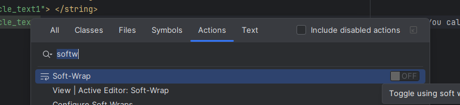
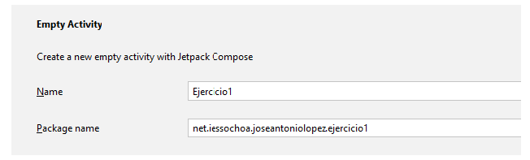
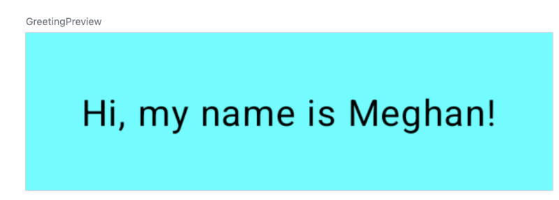
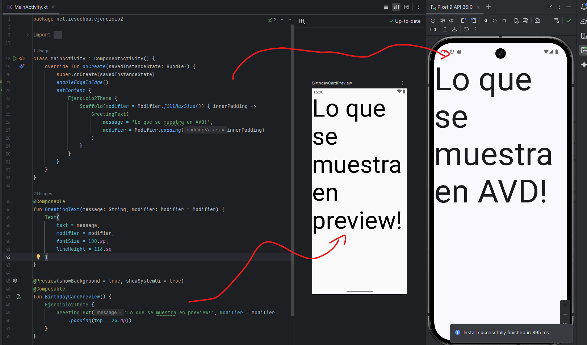
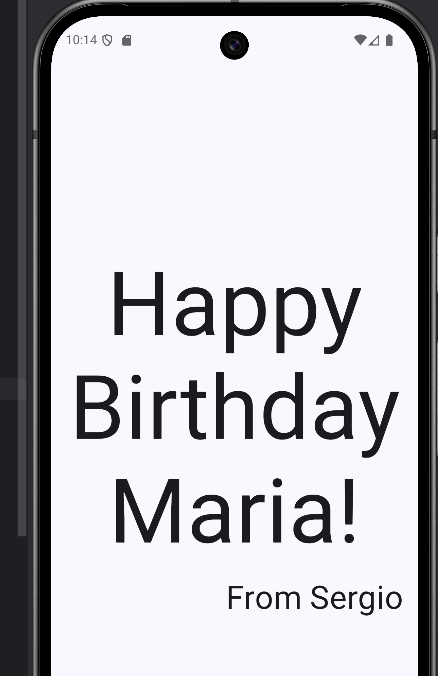
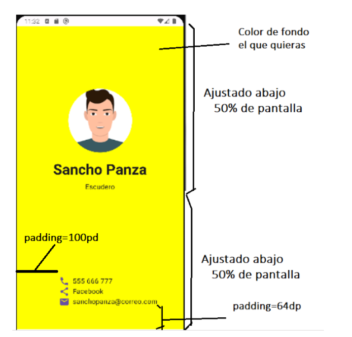

# T03-Android Studio: Primeros pasos

## Índice

- [Introducción](#introducción)
- [Descarga e instalación](#descarga-e-instalación)
- [Diferencias entre interfaces imperativa y declarativa](#diferencias-entre-interfaces-imperativa-y-declarativa)
  - [Enfoque Imperativo](#enfoque-imperativo)
  - [Enfoque Declarativo](#enfoque-declarativo)
  - [Comparación](#comparación)
  - [Resumen](#resumen)
- [Android Studio: Crea y ejecuta tu primera app para Android](#android-studio-crea-y-ejecuta-tu-primera-app-para-android)
- [Depurar apps en dispositivo físico](#depurar-apps-en-dispositivo-físico)
  - [Ejercicio 1](#ejercicio-1)
    - [Pasos en el móvil (Ejemplo MIUI / XIAMOI) 📲](#pasos-en-el-móvil-ejemplo-miui--xiamoi-)
    - [Pasos en Android Studio 💻 (Pendiente Verificar)](#pasos-en-android-studio--pendiente-verificar)
  - [Ejercicio 2](#ejercicio-2)
  - [Ejercicio 3](#ejercicio-3)
  - [Ejercicio 4](#ejercicio-4)
  - [Ejercicio 5](#ejercicio-5)

## Introducción

Para el desarrollo nativo de aplicaciones en Android tenemos un IDE específico para tal tarea. Es gratuito y está basado en IntelliJ. Tenemos versión de instalación para macOS, Windows y Linux. Se trata de **Android Studio**. 🤖

Vamos a seguir una serie de tutoriales de Google para introducirnos en Android Studio:
[https://developer.android.com/courses/pathways/android-basics-compose-unit-1-pathway-2](https://developer.android.com/courses/pathways/android-basics-compose-unit-1-pathway-2)

Paralelamente, ir añadiendo [https://developer.android.com/develop/ui/compose/documentation](https://developer.android.com/develop/ui/compose/documentation) a vuestros favoritos porque os va a ser de gran ayuda para explorar las posibilidades de Jetpack Compose.

## Descarga e instalación

No hay complicaciones para la instalación. Sí que es necesario tener una máquina relativamente potente, pues la emulación de un dispositivo Android no es baladí. Se recomienda tener al menos 8Gb de RAM y un disco SSD.

Las versiones más recientes de Android Studio ya incluyen un JDK (Java Development Kit). Si por alguna razón no lo detecta, el propio instalador te guiará para descargar e instalar una versión compatible, por lo que no es necesaria una instalación previa.

Para completar este paso puedes apoyarte en el siguiente codeLab de Google:
[https://developer.android.com/codelabs/basic-android-kotlin-compose-install-android-studio?hl=es-419\#0](https://www.google.com/search?q=https://developer.android.com/codelabs/basic-android-kotlin-compose-install-android-studio%3Fhl%3Des-419%230)

> [!NOTE]
> Siempre hay que tener en cuenta que la versión de los manuales en castellano puede estar desactualizada y puede ser conveniente seguir a la versión en inglés.

Una cosa interesante es que en Android Studio code podemos activar el soft-wrap es decir, que las líneas largas se ajusten al ancho de la ventana. Esto se hace en:
`Control + Shift + A` y escribimos soft-wrap. Con esto tenemos un toggle para activar o desactivar esta opción. Active Editor : Soft-Wrap



## Diferencias entre interfaces imperativa y declarativa

En el diseño de interfaces de usuario y de programación, los enfoques declarativo e imperativo son dos paradigmas que definen cómo se describe el comportamiento y la lógica en el desarrollo de software y definición de la interface de usuario.


### Enfoque Imperativo

En el diseño imperativo, el desarrollador define explícitamente **cómo** se debe hacer algo, es decir, el paso a paso para lograr un resultado. Se trata de una secuencia de instrucciones que el sistema sigue de manera estricta para cambiar su estado y cumplir con la funcionalidad deseada.

```kotlin
// IMPERATIVE (How)
fun sum(arr: Array<Int>) {
    var result = 0
    for (i in 0 until arr.size) {
        result += arr[i]
    }
    return result
}
```

### Enfoque Declarativo

En el diseño declarativo, el desarrollador se enfoca en **qué** se quiere lograr, dejando que el sistema subyacente se encargue de los detalles sobre cómo hacerlo. No se proporciona una secuencia de pasos detallados, sino una descripción del resultado final deseado.

```kotlin
// DECLARATIVE (What)
fun sum(arr: Array<Int>): Int {
    return arr.reduce { acc, item ->
        acc + item
    }
}
```

### Comparación

| Aspecto | Imperativo | Declarativo |
| :--- | :--- | :--- |
| **Enfoque** | Cómo hacer algo (paso a paso) | Qué hacer o cuál es el estado deseado |
| **Control** | Detallado sobre el flujo y el estado | Se delega al sistema o framework |
| **Uso de estado**| El programador maneja directamente el estado | El sistema maneja el estado automáticamente |
| **Facilidad de mantenimiento**| Puede ser más difícil de mantener | Suele ser más sencillo y conciso |
| **Ejemplo de UI**| Swing, AWT | Jetpack Compose, React |

### Resumen

- **Imperativo:** el programador dicta exactamente cómo se deben ejecutar los pasos.
- **Declarativo:** el programador describe el resultado, dejando que el sistema lo gestione.

El enfoque declarativo es cada vez más popular en lenguajes modernos por su simplicidad y capacidad de reducir el código repetitivo.

-----

## Android Studio: Crea y ejecuta tu primera app para Android

Vamos a crear nuestra primera app y cómo podemos lanzarla en un emulador o en nuestro móvil real (si es Android). Para ello, seguiremos el siguiente codeLab: [https://developer.android.com/codelabs/basic-android-kotlin-compose-first-app](https://developer.android.com/codelabs/basic-android-kotlin-compose-first-app)

Llama al proyecto **Ejercicio1** y en el nombre del paquete indica `net.iesochoa` + `tu nombre`.



> [!WARNING]
> Ten en cuenta que la plantilla que te creará Android Studio en la versión actual es diferente a la que se muestra en el codelab.



## Depurar apps en dispositivo físico

Si no tenéis un ordenador muy potente, el emulador de Android es una de las partes que más recursos consumen. Una opción más ligera puede ser ejecutar la app en nuestro teléfono móvil.

Tenemos el siguiente codeLab que nos explica cómo hacerlo mediante cable USB:
[Codelab connect your Android Device](https://developer.android.com/codelabs/basic-android-kotlin-compose-connect-device#0)

> [!NOTE]
> Es posible que los codeLabs no trabajen con las últimas versiones de Android Studio. En la documentación oficial encontraremos los detalles de las últimas versiones: [https://developer.android.com/studio/run](https://developer.android.com/studio/run).

Para instalar el emulador, puedes seguir los pasos de este vídeo:
[Crear un emulador en Android Studio de forma correcta y rápida.](https://www.youtube.com/watch?v=lhTbyjzujAE)

-----

## Entrega de ejercicios

Para la entrega, dentro de vuestra organización de GitHub, crearéis un repo privado para cada una de los ejercicios. El nombre del repo deberás ser
T03-EjercicioX siendo X el número del ejercicio.

**Trucazo**: Para crear repos como un misil, considera instalar **GitHub CLI**, así desde línea de comandos puedes crearlos sin pasar por la web.
`gh repo create ORG_NAME/REPO_NAME --private --source=. --remote=origin --push`

### Ejercicio 1

Ejecuta tu primera app en un emulador o dispositivo físico siguiendo el codeLab. Llama a tu proyecto "Ejercicio1".

- Haz una captura de pantalla del emulador con la app arrancada. ¡No confundir el emulador con el preview de Compose!
- Intenta ejecutarlo en tu dispositivo físico por USB o Wifi como práctica **opcional**.

> [!NOTE]
> Para este Ejercicio 1 no es preciso que entregues nada. Simplemente para validar que puedes hacerlo bien.
> 
-----

Nota, para poder conectaros con el móvil debe estar activada la **Depuración USB** y opcionalmente la **Depuración inalámbrica** en las **Opciones de desarrollador**.

Esto cambia de móvil a móvil pero, para las opciones de desarrollador hay que ir a "Ajustes > Sobre el teléfono" y pulsar varias veces sobre "Versión del sistema operativo" o "Número de compilación" (depende del fabricante). Tendrás que pulsar unas 7 veces y aparecerá finalmente un mensaje indicando que "¡Ahora eres desarrollador!". Vuelve atrás y entra en Ajustes adicionales > Opciones de desarrollador.

Finalmente deberás emparejar el dispositivo con tu PC usando **ADB** (Android Debug Bridge). ADB es una herramienta de línea de comandos que permite la comunicación con un dispositivo Android. Se incluye con Android Studio y el SDK de Android.

-----

#### Pasos en el móvil (Ejemplo MIUI / XIAMOI) 📲

1. **Activa las Opciones de desarrollador** (si no lo has hecho):
   - Ajustes → Sobre el teléfono → toca 7 veces en *Versión de MIUI*.
2. Ve a **Ajustes adicionales** → **Opciones de desarrollador**.
3. Activa:
   - **Depuración USB** (sí, aunque sea por Wi‑Fi, es requisito previo).
   - **Depuración inalámbrica** (*Wireless debugging*).
4. Dentro de **Depuración inalámbrica**, elige:
   - **Emparejar dispositivo con código de emparejamiento**  
     o  
   - **Emparejar dispositivo con código QR** (Android Studio lo muestra).

 Asegúrate de que **PC y móvil están en la misma red Wi‑Fi**.

#### Pasos en Android Studio 💻 (Pendiente Verificar)

1. Conecta el móvil por USB **solo la primera vez** para que ADB lo reconozca.
2. Abre **Device Manager** → pestaña **Pair using Wi‑Fi**.
3. Elige emparejar por **QR** o **código**:
   - Si usas código:  
     - En el móvil, en *Depuración inalámbrica*, selecciona *Emparejar con código*.  
     - En Android Studio, introduce el código que aparece en el teléfono.
4. Una vez emparejado, Android Studio mostrará tu dispositivo como disponible vía Wi‑Fi.
5. Puedes desconectar el cable y ejecutar la app directamente.

-----

### Ejercicio 2

Sigue el codelab, pero cambia el texto para que aparezca tu nombre y el de María. Puedes ajustar los parámetros de tamaño para que quepa en la pantalla. Llama al proyecto **Ejercicio2**.

Feliz cumpleaños o happy birthday es lo mismo, cualquiera vale.

[https://developer.android.com/codelabs/basic-android-kotlin-compose-text-composables](https://developer.android.com/codelabs/basic-android-kotlin-compose-text-composables)

Un truco aquí con el **preview** es que si queremos que nos muestre algo parecido a la simulación, podemos pasarle la propiedad `showSystemUi = true` y al componente un `Modifier.padding(top = 24.dp)` para que no se solape con la barra de estado.

Si tiráis por ahí, cuando creéis el Composable de GreetingText, al Text le tenéis que pasar el modifier. Esto sería diferente a lo que se muestra en el codelab, pero es más correcto. Luego cuando aparezca el column que envuelve a los dos texts, pues lo podemos mover ahí.

```kotlin
@Preview(showBackground = true, showSystemUi = true)
@Composable
fun BirthdayCardPreview() {
    Ejercicio2Theme {
        GreetingText("Android", modifier = Modifier
            .padding(top = 24.dp))
    }
}
```

```kotlin
@Composable
fun GreetingText(message: String, from: String, modifier: Modifier = Modifier) {
    Column (modifier = modifier) {
        Text(
            text = message,
            fontSize = 100.sp,
            lineHeight = 116.sp
        )
        Text(
        //Mas codigo
```

Tened también en cuenta la diferencia entre lo que nos aparecerá en el preview y lo que se mostrará en el emulador (AVD) o en el móvil.



Ten en cuenta que la plantilla de creación es diferente. En el último paso (**Adopt good practice** se llama en inglés) le pasamos el `padding` de `Scaffold` (innerPadding) ya no tenemos ningún `Surface`.

```kotlin
Ejercicio2Theme {
    Scaffold(modifier = Modifier.fillMaxSize()) { innerPadding ->
        GreetingText(
            message = "Happy Birthday Maria!",
            from = "From Sergio",
            modifier = Modifier.padding(innerPadding)
        )
    }
}
```

Cuestiones a las que deberéis prestar atención:

- Qué el texto from se alinee a la derecha (el modifier de este text tendrá un `.align(Alignment.End)`)
- Que el texto principal esté centrado (se puede hacer con la propiedad `textAlign = TextAlign.Center` que nos indica codelab aunque se podría lo mismo con un modifier)
- Que nuestro componente ocupe toda la pantalla (pasarle en el modifier `fillMaxSize()`).



-----

### Ejercicio 3

A partir del código realizado en Ejercicio 2, crea un nuevo proyecto que llames Ejercicio3, copia el código de Ejercicio2.

Asegúrate de reemplazar los literales que contengan:

- ejercicio2 -> ejercicio3
- Ejercicio2 -> Ejercicio3

Deberían ser unos 5 reemplazos, ya continúa con el codelab para añadir una imagen de fondo.

[https://developer.android.com/codelabs/basic-android-kotlin-compose-add-images](https://developer.android.com/codelabs/basic-android-kotlin-compose-add-images)


En este codelab nos habla de `Modifier` y contenedores (`Column`, `Row`, `Box`). Lee los siguientes artículos como parte del ejercicio:

- [Android Layouts en Jetpack Compose](https://www.develou.com/android-layouts-en-jetpack-compose/)
- [Compose Modificadores de apariencia](https://www.develou.com/compose-modificadores-de-apariencia/)

Es interesante descargar el proyecto con los ejemplos y realizar pruebas:
[https://github.com/jamesreve/android-jetpack-compose.git](https://github.com/jamesreve/android-jetpack-compose.git)

-----

### Ejercicio 4

Crea un nuevo proyecto llamado **Ejercicio4** y crea tres ficheros kotlin (uno para compose article, otro para task manager y el último para compose quadrant) con las funciones composable que definan los ejercicios del siguiente Codelab. Intenta realizar la tarea sin consultar la solución.

[https://developer.android.com/codelabs/basic-android-kotlin-compose-composables-practice-problems](https://developer.android.com/codelabs/basic-android-kotlin-compose-composables-practice-problems)

Puedes crear un nuevo fichero con el botón derecho sobre el paquete: New > Kotlin File/Class

Como se ha visto en los CodeLabs, estas funciones deben ser parametrizadas para poder ser reutilizadas. Por ejemplo, la firma del método para el primer ejercicio podría ser:

```kotlin
@Composable
fun ComposeArticle (
    image: Painter,
    title: String,
    text1: String,
    text2: String,
    modifier: Modifier = Modifier
)
```

-----

### Ejercicio 5

Crea una pantalla que muestre una tarjeta como la propuesta en el codelab:
[https://developer.android.com/codelabs/basic-android-kotlin-compose-business-card](https://developer.android.com/codelabs/basic-android-kotlin-compose-business-card)



Para conseguir que la imagen se muestre circular puedes usar `clip` de `Modifier`:
[https://developer.android.com/develop/ui/compose/graphics/images/customize#clip-image-shape](https://developer.android.com/develop/ui/compose/graphics/images/customize#clip-image-shape)

```kotlin
Image(
    painter = foto,
    contentDescription = null,
    contentScale = ContentScale.Crop,
    modifier = Modifier
        .size(150.dp) // Ajusta el tamaño según tus necesidades
        .clip(CircleShape)
)
```

Para los iconos de contacto, podéis utilizar `Icon`:

```kotlin
Icon(
    imageVector = Icons.Default.Phone, //icono seleccionado
    contentDescription = "teléfono",
    modifier = Modifier.size(24.dp),
    tint = MaterialTheme.colorScheme.primary
)
```

Es aconsejable crear 3 funciones:

1. Crear la función principal de la pantalla con todos los parámetros.
2. Crear una función con la parte superior: Foto, nombre, trabajo.
3. Crear una función con los datos de contacto.

Si lo has completado todo, ¡enhorabuena! Tiene muchísimo mérito arrancar con esto porque hay tantos componentes y atributos que abruma.

Para tu tranquilidad, es normal que al principio no tengas del todo claro por que pasan las cosas, pero poco a poco irás entendiendo el paradigma declarativo y Jetpack Compose.
