# T04-Estado, TextField, Elevación de Estado, Switch, RadioButton

## Índice

- [Introducción](#introducción)
- [Estado](#estado)
  - [Eventos](#eventos)
  - [Recomposición](#recomposición)
  - [MutableState](#mutablestate)
- [Auto import](#auto-import)
- [Entrega de ejercicios](#entrega-de-ejercicios)
  - [Ejercicio 1](#ejercicio-1)
  - [Ejercicio 2](#ejercicio-2)
    - [Mantener el estado ante reconstrucciones](#mantener-el-estado-ante-reconstrucciones)
    - [RadioButton](#radiobutton)
  - [Ejercicio 3: Calculadora](#ejercicio-3-calculadora)

## Introducción

Hemos visto cómo diseñar una pantalla estática mediante Compose, pero el usuario tendrá que interactuar con la App introduciendo datos y seleccionando opciones. Veremos cómo tendremos que mantener el estado de las diferentes opciones del usuario para trabajar con Compose. **Es muy importante** asimilar el patrón necesario para trabajar con estados de los diferentes elementos Composables.

Vamos a seguir los codeLabs de Google, pero tenemos información más completa en los siguientes artículos.

De la fantástica web de Develou empezaremos los siguientes artículos que nos explican algunos de los componentes UI más básicos:

- **TextField**: [https://www.develou.com/android-textfield-en-compose/](https://www.develou.com/android-textfield-en-compose/)
- **Estado**: [https://www.develou.com/android-estado-en-compose/](https://www.develou.com/android-estado-en-compose/)
- **Switch**: [https://www.develou.com/android-switch-en-compose/](https://www.develou.com/switch-en-compose/)

Simplemente recordar que en la siguiente URL [Develou Android Main](https://www.develou.com/android/) tenemos un índice de todos los artículos relacionados con Android de Develou.

Complementaremos las lecturas con el siguiente artículo oficial de Google:

- [Jetpack Compose State](https://developer.android.com/jetpack/compose/state)

Y ahora si ya el codelab oficial de Google:

- [Codelab: State in Jetpack Compose](https://developer.android.com/codelabs/jetpack-compose-state)

## Estado

Un **estado** dentro de una app es cualquier dato que puede cambiar con el tiempo. Esta definición es muy amplia y abarca desde una base de datos hasta una variable de una clase. Todas las apps para Android muestran un estado al usuario.

Estos son algunos ejemplos de estado de las apps para Android:

- Los mensajes más recientes recibidos en una app de chat.
- La foto de perfil del usuario.
- La posición de desplazamiento en una lista de elementos.

> [!NOTE]
> **Idea clave:** El estado determina qué se muestra en la UI en un momento determinado

## Eventos

Los eventos son entradas generadas desde el interior o el exterior de una App, como las siguientes:

- El usuario que interactúa con la UI, por ejemplo, presionando un botón, escribe en un campo de texto, hace scroll en la pantalla...
- Otros factores, como los sensores que envían un valor nuevo o las respuestas de la red...

Si bien el estado de la App representa aquello que se mostrará en la UI, los eventos son el mecanismo de transición entre estados. Por ejemplo, cuando el usuario presiona un botón, se genera un evento que cambia el estado de la App. A continuación, la UI se actualiza para reflejar el nuevo estado.

> [!NOTE]
> **Idea clave:** El estado **es**, el evento **sucede**.

En todas las apps para Android, hay un bucle de actualización principal de la UI:

1. **Evento:** El usuario o alguna otra parte del programa generan un evento.
2. **Estado de actualización:** Un controlador de eventos cambia el estado que usa la UI.
3. **Estado de visualización:** Se actualiza la UI para mostrar el estado nuevo.

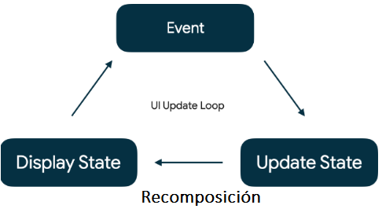

### Recomposición

Una **recomposición** se genera cuando Jetpack Compose vuelve a ejecutar los composables que pueden haberse modificado en respuesta a cambios de estado y, luego, actualiza la composición para reflejar los cambios. Aunque poco tiene que ver con el mundo del desarrollo móvil, es un concepto muy similar a la renderización en React.

### MutableState

Sin embargo, Jetpack Compose no puede observar todos los cambios en el estado de la aplicación de forma automática. Para que Compose sepa cuándo debe volver a componer una parte de la UI, necesitamos usar un tipo especial de estado que se llama `MutableState`, que permiten a Compose observar si hay cambios.


-----

### Auto import

Para que Android Studio importe automáticamente las librerías al vuelo y ahorremos tiempo, activa la opción en `File > Settings > Editor > General > Auto Import`. También puedes activar la opción de `Optimize imports on the fly` que ordena las importaciones automáticamente y elimina las que no se utilizan.

Si prefieres también puedes utilizar el atajo `Alt + Enter` para que te sugiera las importaciones, esto nos servirá para familiarizarnos con las librerías que necesitamos importar.

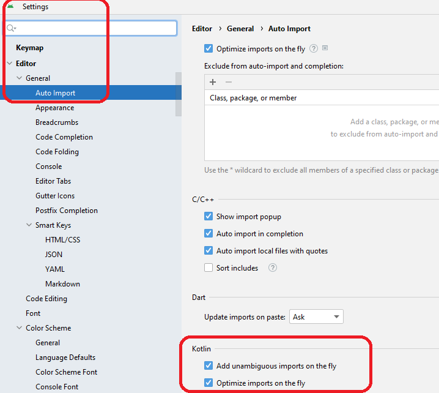

-----

## Entrega de ejercicios

Para la entrega, dentro de vuestra organización de GitHub, crearéis un repo privado para cada una de los ejercicios. El nombre del repo deberás ser
T04-EjercicioX siendo X el número del ejercicio. El ejercicio que calificaré será el último de ellos, pero es prácticamente imposible hacer el último sin haber hecho los anteriores, por lo que es recomendable hacerlos todos y volcarlos en vuestro repositorio.

### Ejercicio 1

Crea un nuevo proyecto. Vamos a seguir el codelab de Google para aprender acerca de los estados en Compose:

[https://developer.android.com/codelabs/basic-android-kotlin-compose-using-state](https://developer.android.com/codelabs/basic-android-kotlin-compose-using-state)

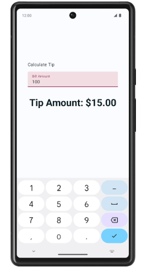

> [!NOTE]
> Ten en cuenta que tienes que hacer un checkout (o git switch) a la rama de `starter` para empezar. `git switch starter` en la terminal de Android Studio o con la interfaz gráfica.

El siguiente vídeo explica el anterior codelab por si no quedase claro siguiendo los pasos: [https://www.youtube.com/watch?v=y6wHf2JLTMg](https://www.youtube.com/watch?v=y6wHf2JLTMg)

Una vez terminado el codelab, lee también el siguiente artículo de Develou: [https://www.develou.com/propiedades-delegadas-en-kotlin/](https://www.develou.com/propiedades-delegadas-en-kotlin/)

**Resumen de aprendizaje:**

- Manejo de recursos de `strings.xml`.
- Formato posicional en String.
- Manejar `TextField`.
- Manejar el estado de `TextField`: `mutableStateOf`.
- Usar la delegación mediante la función `remember`.
- Seleccionar el tipo de teclado para el `TextField`.
- Añadir `label` al `TextField`.
- La clase `NumberFormat`, que permite trabajar con formatos de número para diferentes países.
- Utilizar el patrón de **Elevación de Estado** / **State Hoisting**.
- Delegación de propiedades de Kotlin.

-----

### Ejercicio 2

Seguimos con la misma app en la que veremos propiedades extra del `TextField`.

[https://developer.android.com/codelabs/basic-android-kotlin-compose-calculate-tip](https://developer.android.com/codelabs/basic-android-kotlin-compose-calculate-tip)

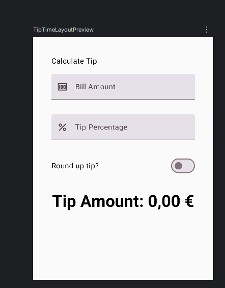

**Resumen de aprendizaje:**

- Establecer el botón de acción del teclado del `TextField`.
- Manejar `Switch`.
- Recordar el estado ante reconstrucciones de la pantalla.
- Composables sin estado.
- Agrega compatibilidad con la orientación horizontal mediante `rememberScrollState()`.

### Mantener el estado ante reconstrucciones

Aunque no lo indica el codelab, puede que te hayas fijado que cuando rotas la app, pierdes los datos introducidos por el usuario. Es debido a que la Activity es destruida e iniciada de nuevo, por lo que los datos son iniciados

Puedes mantener el estado cambiando la función `remember` por `rememberSaveable`.

```kotlin
var amountInput by rememberSaveable { mutableStateOf("") }
```

Prueba que cuando rotas no pierdes los datos.

-----

### RadioButton

El `RadioButton` nos permite seleccionar una opción entre varias. Para definirlo, lo haremos sobre un `Row` o `Column` según cómo queramos mostrarlo, y cada elemento individual mediante un `Row` donde creamos el `RadioButton` y el `Text` con el texto que los representa.

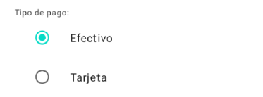

La mejor forma de diseñarlo es:

- Crear una lista de `String` con las opciones.
- Recorremos la lista y definimos cada `RadioButton`.

Tenemos un ejemplo de su definición en Material3: [RadioButton Material3](https://www.composables.com/material3/radiobutton) [cite: 10835]

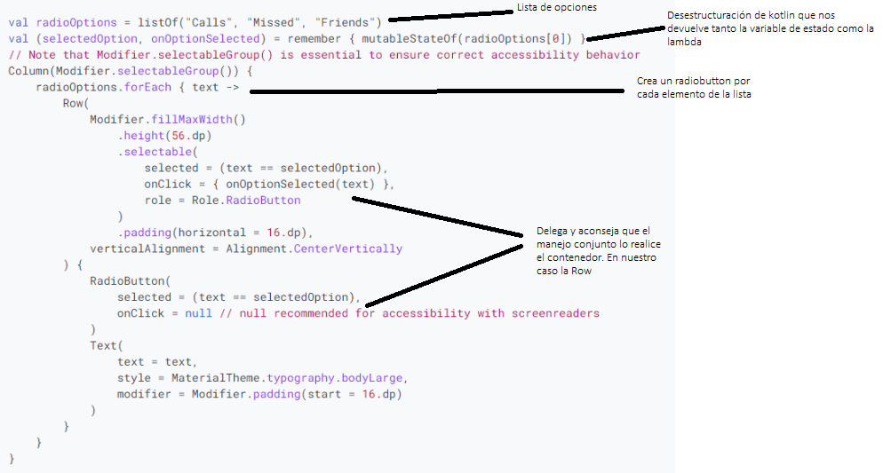

La función para crear un `RadioButton` vertical podría ser:

- Crea un radiobutton para cada opción de la lista. Es conveniente que la lista de texto esté en `strings.xml` como un array de strings.
- La lista la obtenemos desde los recursos. Ejemplo: `val radioOptions = stringArrayResource(R.array.operaciones).toList()`.

Ejemplo de stringArray en `strings.xml`:

```xml
<resources>
    <!-- Otros strings sueltos -->
    <string name="app_name">MiAplicacion</string>

    <!-- Array de opciones para los RadioButton -->
    <string-array name="operaciones">
        <item>Suma</item>
        <item>Resta</item>
        <item>Multiplicación</item>
        <item>División</item>
    </string-array>
</resources>
```

```kotlin
/**
* @param listaOpciones lista de opciones
* @param opcionSeleccionada opción seleccionada
* @param onOptionSelected función que se ejecuta cuando se selecciona una opción
*/
@Composable
fun RowRadioButtonCompose(
    listaOpciones: List<String>,
    opcionSeleccionada: String,
    onOptionSelected: (String) -> Unit,
    modifier: Modifier = Modifier
) {
    Row(
        modifier = modifier
            .fillMaxWidth()
            .selectableGroup(),
        horizontalArrangement = Arrangement.SpaceAround
    ) {
        listaOpciones.forEach { operation ->
            Row(
                modifier = Modifier
                    .weight(1f)
                    .selectable(
                        selected = opcionSeleccionada == operation,
                        onClick = { onOptionSelected(operation) },
                        role = Role.RadioButton
                    )
                    .padding(8.dp),
                verticalAlignment = Alignment.CenterVertically
            ) {
                RadioButton(
                    selected = opcionSeleccionada == operation,
                    onClick = null // El clic se maneja en el Row
                )
                Text(
                    text = operation,
                    style = MaterialTheme.typography.bodySmall
                )
            }
        }
    }
}
```

-----

<!-- markdownlint-disable MD029 MD032-->

### Ejercicio 3: Calculadora

1. **Crea un nuevo proyecto** llamado `T04Ejercicio3` con tu nombre en el `Package name`.

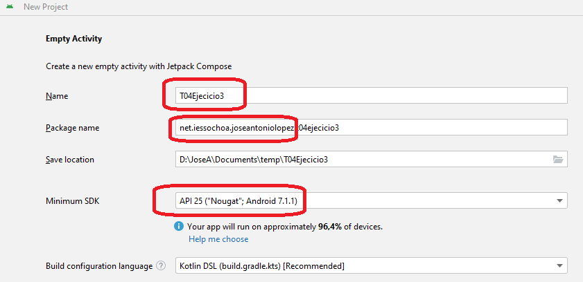

El proyecto deberá ser una `Empty Activity`. Es el que muestra un especie de cubo.

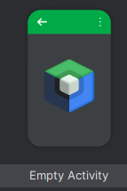

2. **Activa el control de versiones** (`VCS > Enable Version Control Integration...`).

Bien desde el menú contextual o desde la terminal con `git init`.

3. **Realiza el primer commit** con el mensaje "Inicio Ejercicio 1" o similar.

4. **Crea un nuevo repositorio** en tu organización de GitHub con el mismo nombre y asócialo.

5. **Realiza un Push** y comprueba que se sube correctamente.

6. **Realiza suficientes commits** para que se vea la evolución en el tiempo.

**El objetivo:**

Crear una calculadora donde el usuario introduce valores y selecciona la operación mediante un `RadioButton`.

- Cuando se seleccione la operación, muestra el resultado y se cambia el icono (el que vosotros queráis).
- Si no hay valores, el resultado muestra "0".

> [!WARNING]
> - Realiza suficientes commits en el proyecto para que se vea la evolución.
> - Documenta el código.
> - Los strings tienen que estar en `strings.xml`.

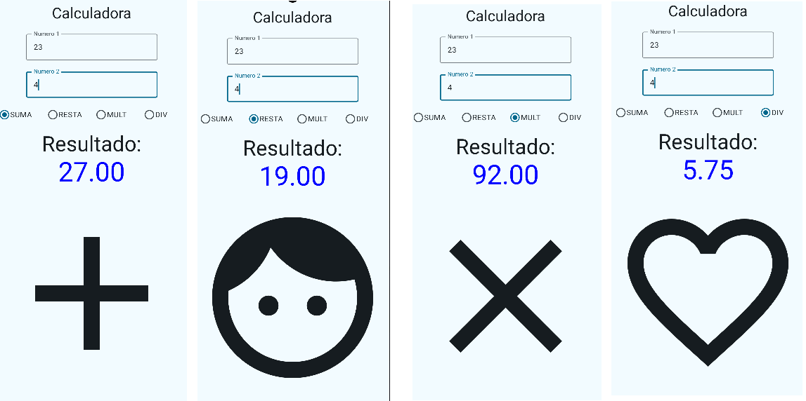
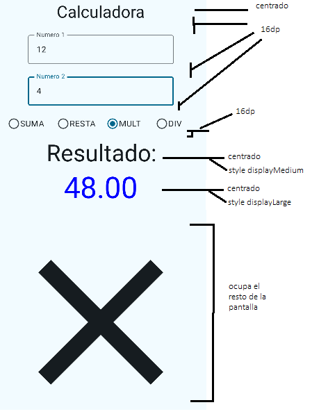

Será necesario que:

1. El teclado sea de tipo numérico, al introducir `num1` permita pasar al `num2` y en `num2` permita cerrar el teclado.

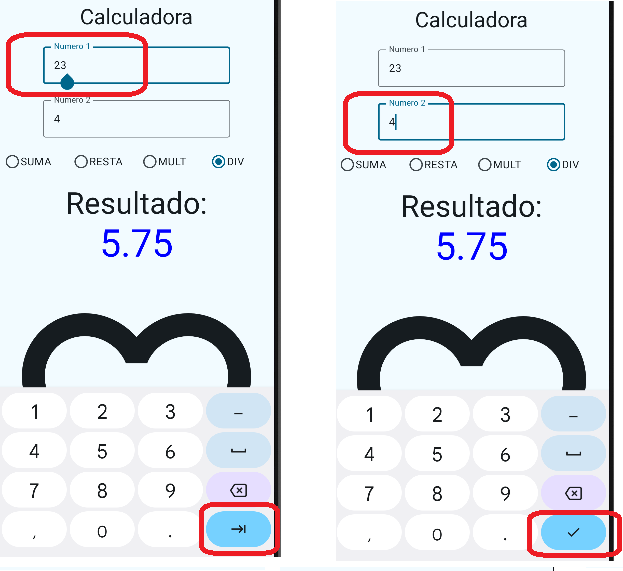

2. Puedes utilizar `OutlinedTextField` en vez de `TextField`.
3. Para mantener el estado, utiliza el patrón de **Elevación de Estado** / **State Hoisting**.
4. Utiliza nuevas funciones Composable en vez de crear los `TextField` directamente.
5. El icono ocupará lo que queda de pantalla. Para ello, podemos darle un `weight(1f)` dentro de la `Column`.

    ```kotlin
    Icon(
        imageVector = icon,
        contentDescription = "Operación seleccionada",
        modifier = Modifier
            .weight(1f)
    )
    ```

6. En caso de giro de pantalla, se mantienen los valores (recuerda usar `rememberSaveable`).

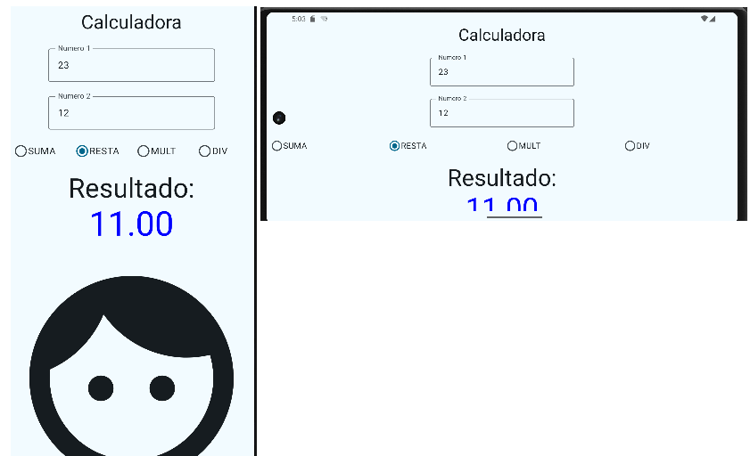

7. Para el diseño del `RadioButton`, Google nos recomienda usarlo como indica el siguiente ejemplo: [https://www.composables.com/material3/radiobutton](https://www.composables.com/material3/radiobutton)


8. Para poder delegar el estado, tendréis que crear un método al que le pasamos el estado actual. La firma del método puede ser:

    ```kotlin
    @Composable
    fun OperacionRadioButton(
        listaOpciones: List<String>,
        operacionSeleccionada: String,
        onOptionSelected: (String) -> Unit,
        modifier: Modifier = Modifier
    )
    ```

9. Puedes ver en el ejemplo que utiliza la **desestructuración** de Kotlin. Puedes revisar este concepto en: [https://www.develou.com/desestructuracion-en-kotlin/](https://www.develou.com/desestructuracion-en-kotlin/)

10. Define un array de string en `strings.xml` y recupéralo con `stringArrayResource(R.array.operaciones).toList()`.

Ejemplo de stringArray en `res -> values -> strings.xml`:

```xml
<resources>
    <!-- Otros strings sueltos -->
    <string name="app_name">MiAplicacion</string>

    <!-- Array de opciones para los RadioButton -->
    <string-array name="operaciones">
        <item>Suma</item>
        <item>Resta</item>
        <item>Multiplicación</item>
        <item>División</item>
    </string-array>
</resources>
```
<!-- markdownlint-restore -->

Puedes recuperarlo con:

```kotlin
val radioOptions = stringArrayResource(R.array.operaciones).toList()
```

> [!IMPORTANT]
> Pese a que el ejemplo de arriba usa **MaterialTheme.typography.bodySmall**. En general es mejor importalo de nuestro paquete para ello usamos **Typography.bodySmall** y en la importación elegimos la nuestra y no Material. Así disfrutamos de un estilo homogéneo y que podemos adaptar más fácilmente en la aplicación.


### **Rúbrica de Evaluación - T04 Ejercicio 3: Calculadora**

Esta rúbrica está diseñada para evaluar sobre 10 puntos, asignando un peso específico a cada área clave del ejercicio.
**Hacer commits frecuentes**, así despejarás dudas sobre la evolución del proyecto y os evitaréis que os pida defenderlo en una entrevista técnica.
Por ejemplo haciendo determinados cambios a todo o nada en la calificación.

| Criterio | **Insuficiente (0-4)** | **Suficiente (5-6)** | **Notable (7-8)** | **Sobresaliente (9-10)** | Ponderación |
| :--- | :--- | :--- | :--- | :--- | :--- |
| **1. Estructura y Buenas Prácticas** | El estado no se eleva (no hay *State Hoisting*). Se usan textos fijos en lugar de recursos `strings.xml` y el código no está documentado. | Se aplica correctamente la elevación de estado en al menos uno de los componentes. La mayoría de los textos están en `strings.xml`, aunque la documentación del código es escasa. | Se aplica correctamente la elevación de estado para todos los componentes. Todos los textos y el array de opciones están en `strings.xml`. El código está parcialmente documentado. | El patrón *State Hoisting* se aplica de forma impecable. El código es modular, está bien documentado y todos los recursos de texto están externalizados correctamente en `strings.xml`. | **30%** |
| **2. Gestión del Estado y Funcionalidad** | La calculadora no realiza las operaciones correctamente o la app se cierra. El estado se pierde al girar la pantalla. | La calculadora realiza las operaciones básicas, pero el estado se pierde al girar la pantalla (usa `remember` en lugar de `rememberSaveable`). El resultado inicial o el cambio de icono puede tener fallos. | Todas las operaciones funcionan y el estado se mantiene al girar la pantalla (`rememberSaveable`). El resultado y el icono se actualizan correctamente, aunque puede haber algún caso borde no controlado (ej. división por cero). | La lógica es impecable: las operaciones son correctas, el estado se preserva perfectamente en la rotación y la UI se actualiza de forma eficiente y sin errores, controlando casos como la falta de valores. | **30%** |
| **3. Interfaz de Usuario (UI) y Componentes** | El diseño es muy diferente al propuesto. Faltan componentes clave como los `RadioButton` o los `TextField`. | La interfaz contiene todos los elementos requeridos (`TextField`, `RadioButton`, `Icon`), pero el diseño y la distribución son básicos y poco fieles al ejemplo. | La interfaz es funcional y se asemeja al diseño propuesto. Los `RadioButton` funcionan y el icono cambia, aunque la distribución del espacio (`weight`) podría mejorarse. | El diseño es fiel al ejemplo, utilizando `OutlinedTextField` y distribuyendo el espacio de forma óptima con `weight` para el icono. La selección del `RadioButton` es visualmente clara y funcional. | **20%** |
| **4. Experiencia de Usuario (UX)** | No se ha configurado el teclado, mostrando el teclado de texto por defecto. | El teclado es de tipo numérico, pero no se han configurado las acciones del teclado (`imeAction`) para facilitar el flujo entre campos. | El teclado es numérico y se ha configurado la acción `Next` para pasar del primer al segundo campo de texto, mejorando la usabilidad. | La experiencia de usuario es fluida. Se usa el teclado numérico y las acciones (`Next` en el primer campo y `Done` en el segundo) funcionan perfectamente para guiar al usuario y cerrar el teclado. | **10%** |
| **5. Control de Versiones (Git)** | No se utiliza control de versiones o solo existe un commit con el proyecto final. | Se ha creado el repositorio, pero solo hay un par de commits sin mensajes descriptivos, lo que no permite ver la evolución del trabajo. | Se utiliza Git con varios commits, pero los mensajes son genéricos ("Update", "Fix"). Se puede seguir la evolución, aunque con dificultad. | El historial de commits es claro, atómico y con mensajes descriptivos. Se puede seguir perfectamente el proceso de desarrollo, desde la configuración inicial hasta la implementación de cada funcionalidad. | **10%** |
