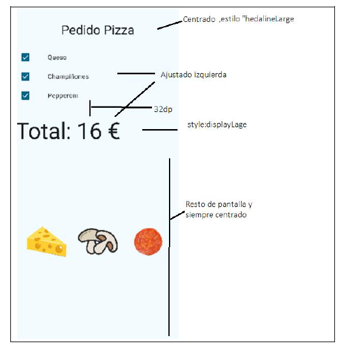
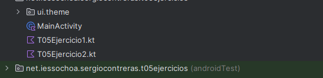
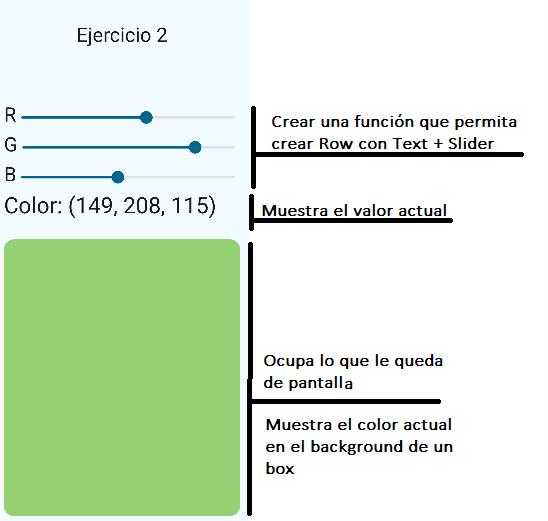
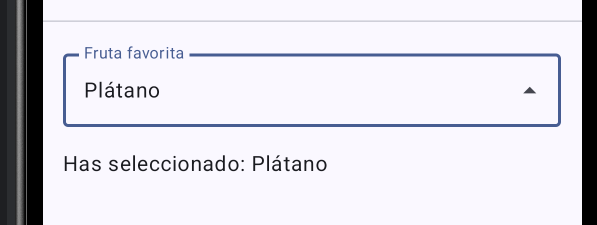
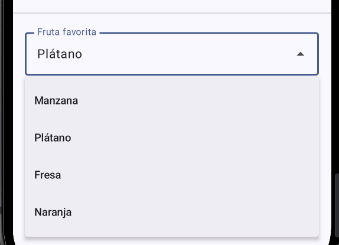
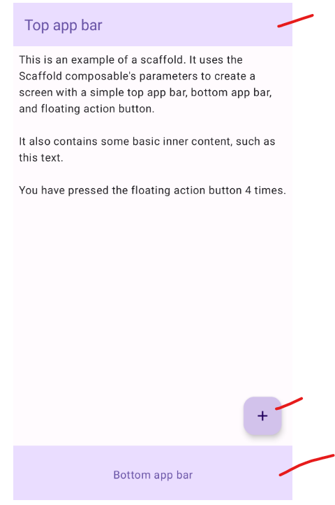
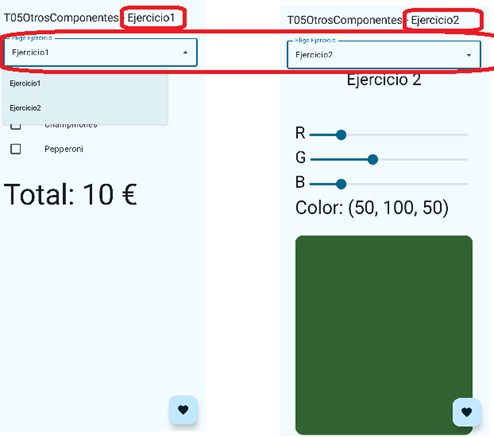
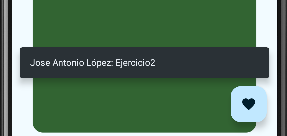
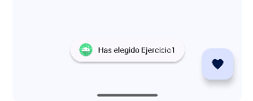

# T05 - CheckBox, Slider, DropDown, RatingBar, FAB, Scaffold, SnackBar, Toast

## Índice

- [Introducción](#introducción)

## Introducción

Vamos a ver otros componentes de la UI de usuario que nos permitirán introducir datos y realizaremos un ejercicio que los incluya a todos. **Como novedad en este tema vamos a trabajar en un único proyecto** y sobre este acumularemos todas nuestras soluciones como ficheros Kotlin. Vuestras plegarias (*lamentos*) han sido escuchadas, además que tenéis razón que Android Studio tarda muchísimo en buildear cada proyecto y es ineficiente.

Antes de arrancar, te comparto una web para que puedas consultar los componentes de Jetpack Compose Material 3, una de las librerías más usadas para crear interfaces de usuario en Android: [https://m3.material.io/components](https://m3.material.io/components)

## CheckBox

El `CheckBox` es un elemento muy parecido al `Switch` que ya vimos, pero con otra apariencia. Al igual que el `Switch`, necesita un `Text` para mostrar la etiqueta. Puedes ver un completo manual en: [https://www.develou.com/android-checkbox-en-compose/](https://www.develou.com/android-checkbox-en-compose/)

También podemos encontrarlo en la documentación oficial de Jetpack Compose: [Checkbox](https://developer.android.com/develop/ui/compose/components/checkbox)

Recuerda que nosotros utilizaremos la **elevación de estado** (**State Hoisting**) para manejar el estado de los controles.

-----

## Ejercicio 1

1. Crea un nuevo proyecto **Empty Activity** (Compose) llamado `T05Ejercicios`. Este lo vamos a usar a lo largo de todo este bloque de ejercicios.

    Indicando como `Package name` tu nombre, como muestra la imagen:

    

2. Activa el control de versiones (`VCS > Enable Version Control Integration...`) o `git init` en la terminal.
3. Realiza el git add . y el git commit -m "first commit" o cualquier mensaje similar.
4. Crea un nuevo repositorio en tu organización de GitHub con el mismo nombre y asócialo.

> [!NOTE]
> Abajo el walkthrough con Github CLI. Hay que ejecutarlo desde el directorio del proyecto.

```bash
gh repo create ORGANIZACION/NOMBRE_REPO --private --source=. --remote=origin
git push -u origin main
```

Imagen con mi organización y proyecto (que no se llama exactamente igual pero bueno... se entiende la idea):


5. Si no lo has hecho en el paso anterior, realiza ahora un push para comprobar que se sube correctamente.
6. Durante el progreso del ejercicio, realiza suficientes commits para que se vea la evolución en el tiempo.
7. Crea un nuevo fichero de Kotlin llamado `T05Ejercicio1.kt`.


8. Crea las funciones Composables para una pantalla de un pedido de pizza en el que:
    a. El pedido base vale **10 €**.
    b. Permite añadir ingredientes a **2 €** cada uno. Pon al menos 3 ingredientes, los que tú prefieras, intenta ser original.
    c. Mostrará el total según los ingredientes seleccionados.
    d. Mostrará las imágenes de los ingredientes seleccionados.


### Especificaciones

- La función composable se encuentra en un fichero llamado `T05Ejercicio1.kt`.
- La UI deberá cumplir con las indicaciones mostradas en la siguiente imagen:



- Busca unas imágenes en Internet para los ingredientes e impórtalas a tu proyecto en la carpeta `drawable`.
- Las imágenes se mostrarán centradas respecto al espacio que le quede de pantalla. Para ello, el `Row` donde irán las imágenes debe ocupar todo el espacio y centrar su contenido.
- Todo el texto que se muestre al usuario tiene que ir en `string.xml`, por ejemplo: `label = stringResource(R.string.queso)`.
- El código tiene que estar minimamente documentado.
- Puedes añadir las mejoras visuales que desees. Por ejemplo, poner una imagen de una pizza de fondo de los ingredientes principales (acuérdate de `Box`).
- Puedes probar la función en la `Activity` principal.
- Realiza commits que permitan ver la evolución del proyecto y cuando termines el ejercicio, crea un commit llamado "fin ejercicio1".

> [!NOTE]
> Si te animas puedes crear una **tag** llamada `v1.0` para marcar la versión final del ejercicio 1.
> Esto es opciona, pero es una buena práctica para identificar hitos importantes en el desarrollo de un proyecto (aka versiones estables).

```bash
git tag v1.0
git push origin v1.0
```

-----

## Slider

El `Slider` es un control muy útil en aplicaciones móviles para la introducción de datos numéricos limitados por rangos. Seguiremos el manual:
[https://www.develou.com/slider-en-compose/](https://www.develou.com/slider-en-compose/)

También podemos encontrarlo en la documentación oficial de Jetpack Compose: [Slider](https://developer.android.com/develop/ui/compose/components/slider)

-----

## Ejercicio 2

9. Añade un fichero kotlin al proyecto anterior llamado `Ejercicio2.kt`.



10. Crea un commit llamado "Inicio Ejercicio 2".

11. Crea las funciones Composables para una pantalla que permita elegir un color al usuario utilizando sliders.



Ten en cuenta que el `Slider` devuelve valores `Float`, pero la clase `Color` necesita `Int`. En Kotlin es sencillo hacer el cast:

    ```kotlin
    .background(Color(red.toInt(), green.toInt(), blue.toInt()))
    ```

12. Averigua cómo crear las esquinas redondeadas.

13. Realiza commits que permitan ver la evolución del proyecto y cuando termines el ejercicio, crea un commit llamado "fin Ejercicio2".

-----

## Menú Desplegable (DropDown Menu)



En Jetpack Compose con Material 3, para crear un menú desplegable asociado a un campo de texto (similar a un `Spinner` tradicional o un `<select>` en HTML), se utiliza el componente `ExposedDropdownMenuBox`. Este composable envuelve un `TextField` (generalmente no editable) y el menú desplegable (`ExposedDropdownMenu`) que aparece al interactuar con él. Los ítems individuales del menú se definen con `DropdownMenuItem`.

Aunque existe un `DropdownMenu` más genérico, `ExposedDropdownMenuBox` es el componente específico y recomendado cuando necesitas un selector desplegable vinculado visualmente a un campo de texto.

Para facilitar su reutilización, podemos encapsular esta lógica en una función composable personalizada. A continuación, se muestra un ejemplo de cómo crear un `DynamicSelectTextField` reutilizable:

```kotlin
@OptIn(ExperimentalMaterial3Api::class)
@Composable
fun DynamicSelectTextField(
    selectedValue: String,
    options: List<String>,
    label: String,
    onValueChangedEvent: (String) -> Unit,
    modifier: Modifier = Modifier
) {
    var expanded by remember { mutableStateOf(false) }

    ExposedDropdownMenuBox(
        expanded = expanded,
        onExpandedChange = { expanded = !expanded },
        modifier = modifier
    ) {
        OutlinedTextField(
            readOnly = true, // El campo de texto no se edita directamente
            value = selectedValue,
            onValueChange = {}, // Vacío porque es readOnly
            label = { Text(text = label) },
            trailingIcon = {
                // Icono que indica si el menú está desplegado o no
                ExposedDropdownMenuDefaults.TrailingIcon(expanded = expanded)
            },
            colors = OutlinedTextFieldDefaults.colors(), // Colores por defecto
            modifier = Modifier
                .menuAnchor() // Ancla el menú al TextField
                .fillMaxWidth()
        )
        // El menú desplegable en sí
        ExposedDropdownMenu(
            expanded = expanded,
            onDismissRequest = { expanded = false } // Acción al cerrar el menú
        ) {
            // Itera sobre las opciones para crear cada item del menú
            options.forEach { option: String ->
                DropdownMenuItem(
                    text = { Text(text = option) },
                    onClick = {
                        expanded = false // Cierra el menú
                        onValueChangedEvent(option) // Llama al callback con la opción seleccionada
                    }
                )
            }
        }
    }
}
```

**Parámetros de `DynamicSelectTextField`:**

  * `selectedValue`: El valor (String) actualmente seleccionado, que se muestra en el `TextField`. Define el estado inicial.
  * `options`: Una lista de Strings (`List<String>`) que representan las opciones disponibles en el desplegable.
  * `label`: La etiqueta (String) que se muestra en el `OutlinedTextField`.
  * `onValueChangedEvent`: Una función lambda `(String) -> Unit` que se invoca cuando el usuario selecciona una nueva opción. Recibe la opción seleccionada como parámetro.
  * `modifier`: Un `Modifier` opcional para personalizar la apariencia o disposición del componente.

**Ejemplo de uso:**

```kotlin
@Composable
@Preview(showBackground = true)
fun EjemploDropdownMenu() {
    val options = listOf("Manzana", "Plátano", "Fresa", "Naranja")
    // Estado para guardar la selección actual
    var (seleccion, onValueChanged) = remember { mutableStateOf(options[0]) } // Opción por defecto

    Column(modifier = Modifier.padding(16.dp)) {
        DynamicSelectTextField(
            selectedValue = seleccion,
            options = options,
            label = "Fruta favorita",
            onValueChangedEvent = onValueChanged // Actualiza el estado al seleccionar
        )
        Spacer(modifier = Modifier.height(16.dp))
        Text("Has seleccionado: $seleccion") // Muestra la selección actual
    }
}
```



Trucazo 🤙: Para mejorar la usabilidad, si la lista de `options` es muy larga, considera alternativas como un diálogo de selección con filtro de búsqueda o agrupar las opciones en submenús si la lógica lo permite. Esto evita que el usuario tenga que hacer un scroll excesivo.

## RatingBar

Permite que el usuario de forma visual pueda valorar o ver la valoración de una entidad (película, música, artículo...). En estos momentos, no tenemos un componente específico que lo represente, pero vamos a crear una función sencilla que nos permita manejarlo.

La función crea un `Row` con al menos 5 `Icon`. En función del rating actual, se dibuja un icono relleno o hueco.


La función quedaría como sigue:

```kotlin
/**
 * Rating bar composable
 * @param maxRating número de estrellas
 * @param currentRating rating actual
 * @param onRatingChanged callback para cuando se cambia el rating
 * @param iconSelect icono para seleccionado
 * @param iconUnSelect icono para no seleccionado
 * @param modifier modificador
 * @param color color de las estrellas
 */
@Composable
fun RatingBar(
    maxRating: Int = 5,
    currentRating: Int,
    onRatingChanged: (Int) -> Unit,
    iconSelect: ImageVector = Icons.Filled.Star,
    iconUnSelect: ImageVector = Icons.Outlined.Star,
    modifier: Modifier = Modifier,
    color: Color = Color.Red
) {
    // 1. Aplica el modifier del parámetro al componente raíz (el Row)
    Row(modifier = modifier) {
        for (i in 1..maxRating) {
            Icon(
                imageVector = if (i <= currentRating) iconSelect else iconUnSelect,
                contentDescription = "Star $i",
                // 2. Crea un Modifier nuevo y local para cada Icon
                modifier = Modifier.clickable {
                    onRatingChanged(
                        if (i == 1 && currentRating == 1) 0 else i
                    )
                },
                tint = if (i <= currentRating) color else Color.Unspecified
            )
        }
    }
}
```


-----

## Floating Action Button (FAB)

El FAB es un botón para destacar la acción principal de una ventana en tu app.


Podemos ver los detalles de uso en Material.io:
[https://m3.material.io/components/floating-action-button/overview](https://m3.material.io/components/floating-action-button/overview)

Y en Develou tenemos un buen manual:
[https://www.develou.com/floating-action-button-en-compose/](https://www.develou.com/floating-action-button-en-compose/)

-----

## Scaffold

En Material Design, un `Scaffold` es una estructura fundamental que proporciona una plataforma estandarizada para interfaces de usuario complejas. Une diferentes partes de la IU, como barras de la app y botones de acción flotantes.



Cuando creamos un nuevo proyecto, la `Activity` está montada por defecto sobre la función composable `Scaffold`.

Si nos fijamos en sus parámetros, podemos añadir `topBar`, `bottomBar`, `floatingActionButton` y `snackbarHost`.

Aquí puedes ver lo que es el snackbar [snackbar m3](https://m3.material.io/components/snackbar/overview)

-----

## Ejercicio 3

14. Realiza commit "Inicio ejercicio 3".

15. Añade a la función `Scaffold` desde su correspondiente parámetro una `TopBar`.

    ```kotlin
    Scaffold(
        modifier = Modifier.fillMaxSize(),
        topBar = {
            TopAppBar(title = { Text(text = stringResource(R.string.app_name)) })
        }
    ) { innerPadding ->
        //...
    }
    ```

16. Prueba que funciona.

17. Saca a una función Composable propia llamada `App()` el `Scaffold`.

    ```kotlin
    class MainActivity : ComponentActivity() {
        override fun onCreate(savedInstanceState: Bundle?) {
            super.onCreate(savedInstanceState)
            enableEdgeToEdge()
            setContent {
                T05OtrosComponentesTheme {
                    App()
                }
            }
        }
    }

    @OptIn(ExperimentalMaterial3Api::class)
    @Composable
    fun App() {
        //... Scaffold va aquí
    }
    ```

18. El objetivo es poder elegir el **Ejercicio1** y el **Ejercicio2** desde una lista desplegable.

* Mostrará en la `TopBar` el ejercicio actual.



* Cuando pulsemos sobre el `FloatingActionButton`, mostrará un mensaje con tu nombre y el ejercicio actual.



19. Deberás tener elevado el estado de la lista desplegable.

20. Los elementos de la lista desplegable tienen que guardarse como un array de string en `strings.xml`.

    ```xml
    <string-array name="opciones">
        <item>Ejercicio1</item>
        <item>Ejercicio2</item>
    </string-array>
    ```

    Y recuperarlos en la función **App**: `val opciones = stringArrayResource(R.array.opciones).toList()`

21. Crea un nuevo fichero kotlin donde copias el método para crear listas desplegables que hemos visto antes (`DynamicSelectTextField`).

22. El estado de la lista lo necesitamos para el título y el mensaje, por lo que se tiene que elevar hasta la función `App`.

    ```kotlin
    fun App() {
        val opciones = stringArrayResource(R.array.opciones).toList()
        var (ejercicioActual, onValueChangeEjercicio) = remember { mutableStateOf(opciones[0]) }
        //...
    }
    ```

23. Crea un método Composable llamado `Body` que muestre el contenido principal (lista y ejercicio) y llámalo desde el `Scaffold`.

    ```kotlin
    Scaffold(...) { innerPadding ->
        Body(opciones, ejercicioActual, onValueChangeEjercicio, Modifier.padding(innerPadding))
    }
    ```

    Este método `Body` mostrará la lista desplegable y, en función del elemento elegido, mostrará el Ejercicio 1 o el Ejercicio 2.

-----

## Mensajes rápidos al usuario

### Toast

Un `Toast` proporciona información simple sobre una acción en una pequeña ventana emergente que desaparece automáticamente.


24. En el método `Body`, añade la siguiente llamada al final para que se muestre un `Toast` al cambiar de ejercicio:

    ```kotlin
    Toast.makeText(LocalContext.current, "Has elegido $ejercicioActual", Toast.LENGTH_SHORT).show()
    ```

Prueba que funciona.



### Snackbar

El `Snackbar` es una barra inferior que sirve para mostrar un mensaje al usuario y/o tomar alguna acción. Se gestiona a través del `Scaffold`. Necesita ser lanzado en una Corrutina (hilo ligero de Kotlin), que veremos más adelante. Manual muy completo en [https://www.develou.com/scaffold-en-jetpack-compose/](https://www.develou.com/scaffold-en-jetpack-compose/)

25. En tu función `App`, define las variables de estado necesarias para manejar el `Snackbar`.

    ```kotlin
    val snackbarHostState = remember { SnackbarHostState() }
    val scope = rememberCoroutineScope()
    ```

26. Define un `SnackbarHost` en el `Scaffold`.

    ```kotlin
    Scaffold(
        //...
        snackbarHost = {
            SnackbarHost(snackbarHostState)
        },
        //...
    )
    ```

27. Muestra el mensaje agregando un `FloatingActionButton` al `Scaffold`.

    ```kotlin
    floatingActionButton = {
        FloatingActionButton(onClick = {
            //muestra el SnackBar desde un hilo
            scope.launch {
                snackbarHostState.showSnackbar(
                    message = "Jose Antonio López: $ejercicioActual",
                    duration = SnackbarDuration.Short
                )
            }
        }) {
            Icon(Icons.Filled.Favorite, contentDescription = "Mostrar Snackbar")
        }
    }
    ```

28. Prueba que funciona.

29. Realiza un commit llamado "fin ejercicio 3" o similar. Y si ya te animas a crear una tag `v3.0` para marcar la versión final del ejercicio 3, pues mejor que mejor.

> ![NOTE]
> Si tiras por la tag, recuerda que además de crearla hay que subirla al repositorio remoto:

```bash
git tag v3.0
git push origin v3.0
```


-----

### Entrega:

  * Ordena y documenta el código.
  * Entrega los enlaces a GitHub a los dos proyectos trabajados.
  * Recuerda que todo el texto tiene que estar en `String.xml`.
