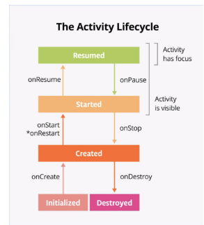
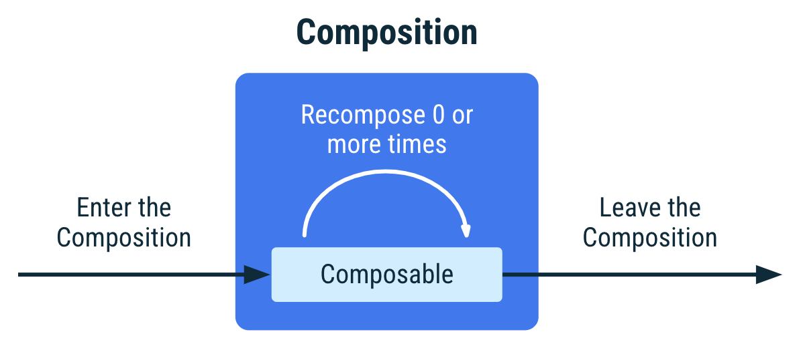

# T07-Ciclo de vida de la Activity y arquitectura MVVM



## Introducción

El ciclo de vida de una aplicación Android es bastante diferente al ciclo de vida de una aplicación en otros S.O., como podría ser Windows. La mayor diferencia es que, en Android el ciclo de vida está controlado principalmente por el sistema y no directamente por el usuario.

Es importante entender qué ocurre en un dispositivo móvil y lo peculiar del sistema operativo respecto a uno de escritorio como Windows.

Para ello vamos a ver los siguientes vídeos:

* [https://www.youtube.com/watch?v=stnLbKk0wak](https://www.youtube.com/watch?v=stnLbKk0wak)
* [https://www.youtube.com/watch?v=hbzzZ-orRWg](https://www.youtube.com/watch?v=hbzzZ-orRWg)

Para resolver la problemática y que el usuario no pierda en ningún momento su experiencia, el programador tiene que encargarse de evitar la pérdida de datos, para ello, disponemos de una serie de eventos que nos permite controlar el ciclo de vida de la Activity para que, por ejemplo:

* No falle si el usuario recibe una llamada telefónica o cambia a otra app mientras usa la tuya.
* No consuma recursos valiosos del sistema cuando el usuario no la use de forma activa.
* No pierda el progreso del usuario si este abandona tu app y regresa a ella posteriormente.
* No falle ni pierda el progreso del usuario cuando se gire la pantalla entre la orientación horizontal y la vertical.

Cada vez que una actividad cambia de estado se van a generar eventos que podrán ser capturados por ciertos métodos de la actividad. A continuación, se muestra un esquema que ilustra los métodos que capturan estos eventos.


Puedes ver el siguiente vídeo para entender mejor el ciclo de vida: [https://www.youtube.com/watch?v=E1vAobJ8Fxo](https://www.youtube.com/watch?v=E1vAobJ8Fxo)

Ojo: No confundir el ciclo de vida de la Activity con el ciclo de vida del Composable, que es diferente aunque dependiente del primero. [https://developer.android.com/develop/ui/compose/lifecycle](https://developer.android.com/develop/ui/compose/lifecycle)



-----

## Ejercicios

Este es un tema muy complejo, por lo que vamos a hacerlo un poco más **amigable** siguiendo el training oficial de Android: [https://developer.android.com/courses/android-basics-compose/course](https://developer.android.com/courses/android-basics-compose/course). Esto corresponde con parte de la **Unit 4: Navigation and app architecture**.

De momento nos vamos a centrar sólo en el **Pathway 1: Architecture components** [https://developer.android.com/courses/pathways/android-basics-compose-unit-4-pathway-1](https://developer.android.com/courses/pathways/android-basics-compose-unit-4-pathway-1) que ya tiene una duración estimada más que adecuada.

Cuando lleguemos a los codelabs, para traernos ese trabajo a nuestra organización, realizaremos la siguiente secuencia de acciones. Básicamente clonamos el repo oficial rama starter (que es la que nos piden), eliminamos su historial git, inicializamos un nuevo repo git, creamos el repo en nuestra organización y hacemos el primer push.

```bash
git clone --branch starter https://github.com/google-developer-training/basic-android-kotlin-compose-training-dessert-clicker
cd basic-android-kotlin-compose-training-dessert-clicker
rm -rf .git     
git init -b main
git add .
git commit -m "Initial commit from Codelab starter"
gh repo create Movil2025SergioContrerasLopez/basic-android-kotlin-compose-training-dessert-clicker --private --source=. --remote=origin
git push -u origin main
```
> [!NOTE]
> En PowerShell rm nos fallará. Siempre podemos borrar manualmente el .git o aprendernos su comando Remove-Item
> Recuerda también los git config user.name y user.email si es necesario después del init

Este codelab nos servirá también para hacer la práctica de **Add a ViewModel to Dessert Clicker**.

> [!NOTE]
> Si bien con sólo se pide entregar dos de los codelabs, es **totalmente imprescindible** realizar del de **ViewModel and State in Compose**.
> A nivel de contenidos es probablemente el más importante.

### Conceptos clave del Codelab: La pizarra y la ventana

Imagina que tu `ViewModel` es como el aula del instituto, pero una con ventanas. Dentro del aula tenemos nuestra pizarra digital (el `MutableStateFlow`), y fuera del aula, tenemos una ventana de cristal (el `StateFlow`) a través de la cual los estudiantes que no han podido entrar al aula pueden ver lo que voy escribiendo.

1. **`MutableStateFlow` (La Pizarra Privada)** 📝

      * Es la pizarra **dentro** de nuestra aula (`ViewModel`).
      * Como es *nuestra* y es *mutable*, podemos **escribir** en ella, **borrar** y **actualizarlo** cuando queramos.
      * Contiene la "fuente de la verdad". Si el estado es "5 postres vendidos", eso es lo que aparece en la pizarra.
      * Nadie fuera del aula puede tocarlo. Es **privada**.

2.  **`StateFlow` (La Ventana Pública de "Solo Lectura")** 🪟

      * Es una **ventana de cristal** que da al exterior (a la `UI` / Composable).
      * Cualquiera (la UI) puede **mirar** a través de la ventana y **ver** lo que aparece en la pizarra *en ese mismo instante*.
      * **No pueden escribir** a través de la ventana. Es de **solo lectura**.
      * Si cambiamos lo que aparece escrito y ponemos "6 postres vendidos", todos los que miran por la ventana ven "6 postres vendidos" inmediatamente.

Tu `ViewModel` usa el `MutableStateFlow` (la pizarra) para gestionar sus propios datos y expone un `StateFlow` (la ventana) para que la UI pueda reaccionar a esos datos sin poder modificarlos directamente.

-----

### `MutableStateFlow`: El Propietario del Estado

Es el **contenedor de estado mutable**. Su único trabajo es **mantener el valor del estado actual** y permitir que se **actualice**.

* **Característica Clave:** Es un "flujo caliente" (hot flow). Esto significa que **siempre tiene un valor**. Debes darle un valor inicial obligatorio.
* **Propiedad Principal:** `.value`.
  * Puedes **leer** el valor actual: `val contador = _miEstado.value`.
  * Puedes **escribir** (actualizar) el valor: `_miEstado.value = 10`.
* **Uso Típico:** Se crea y se mantiene **privado** dentro del `ViewModel`. La convención es usar un guion bajo (`_`) para marcarlo como privado.

**Ejemplo de creación:**

```kotlin
// Dentro de tu ViewModel
// El estado inicial es 0
private val _contador = MutableStateFlow(0)
```

-----

### `StateFlow`: El Observador del Estado

Es la **vista inmutable (solo lectura)** del `MutableStateFlow`.

* **Característica Clave:** Expone el estado al mundo exterior (la UI) de forma segura.
* **Propiedad Principal:** `.value`.
  * Puedes **leer** el valor actual: `val contadorActual = miEstado.value`.
  * **NO PUEDES** escribir en él: `miEstado.value = 10` // \<-- ¡Error de compilación\!
* **En esteroides para la UI:** Cuando un Composable se suscribe (recolecta) a este flujo, recibe **inmediatamente el valor actual** y luego recibe automáticamente cualquier actualización futura.

**Ejemplo de exposición:**

```kotlin
// Dentro de tu ViewModel
private val _contador = MutableStateFlow(0)

// Exponemos una versión pública de SOLO LECTURA
val contador: StateFlow<Int> = _contador.asStateFlow()
```

La función `.asStateFlow()` es la que "crea la ventana" a partir de la "pizarra".

-----

### El Patrón Completo en `ViewModel` y `UI`

Este es el rompecabezas completo, conectando `UiState` con `StateFlow`.

#### 1. El `ViewModel` (El Cerebro)

El `ViewModel` es el **dueño** del estado. Usa `MutableStateFlow` para *gestionar* el estado y expone un `StateFlow` para que la UI lo *observe*.

```kotlin
// 1. Define tu clase de estado (¡esto ya lo hiciste!)
data class DessertUiState(
    val revenue: Int = 0,
    val dessertsSold: Int = 0,
    // ...etc.
)

// 2. Tu ViewModel
class DessertViewModel : ViewModel() {

    // ----------------------------------------------------
    // PASO 1: El Pizarrón (Privado y Mutable)
    // Contiene el estado completo de la pantalla.
    // ----------------------------------------------------
    private val _uiState = MutableStateFlow(DessertUiState()) // <-- Valor inicial


    // ----------------------------------------------------
    // PASO 2: La Ventana (Pública y de Solo Lectura)
    // La UI observará esto.
    // ----------------------------------------------------
    val uiState: StateFlow<DessertUiState> = _uiState.asStateFlow()


    // ----------------------------------------------------
    // PASO 3: Lógica de Negocio (Eventos de la UI)
    // La UI llama a esta función para "pedir" un cambio.
    // ----------------------------------------------------
    fun onDessertClicked() {
        
        // El ViewModel es el único que puede actualizar el pizarrón
        _uiState.update { currentState ->
            // .update es seguro para concurrencia
            // .copy() crea un nuevo estado inmutable
            val newRevenue = currentState.revenue + 5 // O lógica real
            val newDessertsSold = currentState.dessertsSold + 1
            
            currentState.copy(
                revenue = newRevenue,
                dessertsSold = newDessertsSold
            )
        }
    }
}
```

#### 2. El Composable (La Vista)

La UI **no posee estado**. Simplemente se suscribe al `StateFlow` del `ViewModel` y se redibuja cuando el estado cambia.

```kotlin
@Composable
fun DessertClickerApp(
    viewModel: DessertViewModel = viewModel() // Obtiene la instancia del ViewModel
) {
    // ----------------------------------------------------
    // PASO 4: Observar el Estado
    // .collectAsStateWithLifecycle() es la forma moderna y segura
    // de recolectar un StateFlow en Compose.
    // "uiState" aquí es una variable de estado de Compose.
    // ----------------------------------------------------
    val uiState by viewModel.uiState.collectAsStateWithLifecycle()

    // ----------------------------------------------------
    // PASO 5: Dibujar la UI (Flujo de datos hacia abajo)
    // La UI es "tonta", solo dibuja lo que "uiState" le dice.
    // ----------------------------------------------------
    DessertClickerScreen(
        revenue = uiState.revenue,
        dessertsSold = uiState.dessertsSold,
        dessertImageId = uiState.currentDessertImageId,
        
        // ----------------------------------------------------
        // PASO 6: Notificar Eventos (Flujo de eventos hacia arriba)
        // Cuando el usuario hace clic, la UI no cambia el estado,
        // solo le "avisa" al ViewModel.
        // ----------------------------------------------------
        onDessertClicked = {
            viewModel.onDessertClicked() 
        }
    )
}
```

-----

### ¿Por Qué esta Separación? (El Flujo de Datos Unidireccional)

Este patrón se llama **Flujo de Datos Unidireccional (UDF)** y es la arquitectura central de Compose.

1. **Estado (State) fluye hacia abajo:**
    El `ViewModel` (dueño del estado) envía el `UiState` hacia la `UI`.
    *(VM -> UI)*

2. **Eventos (Events) fluyen hacia arriba:**
    La `UI` (clics, texto) envía eventos al `ViewModel` para solicitar cambios.
    *(UI -> VM)*

Al usar `MutableStateFlow` (privado) y `StateFlow` (público), **fuerzas** este patrón. La UI *no puede* romper las reglas y modificar el estado directamente. Solo puede *pedirle* al `ViewModel` que lo haga.

Esto te da:

* **Seguridad:** El estado es coherente, ya que solo se modifica en un lugar (el VM).
* **Facilidad de Pruebas (Testing):** Puedes probar tu `ViewModel` por separado sin necesidad de una UI.
* **Depuración Sencilla:** Sabes exactamente de dónde vienen los cambios de estado.

🚩 **TLDR - Entrega** 🚩: La entrega consiste en un único repo en el que se completan los codelabs **Stages of the Activity lifecycle** y **Add a ViewModel to Dessert Clicker**. Es importante que la commit history sea clara y muestre el progreso del trabajo realizado.

En cualquier caso, se espera que realicéis todos los codelabs de esta Unit 4, al menos del **Pathway 1: Architecture components**.
