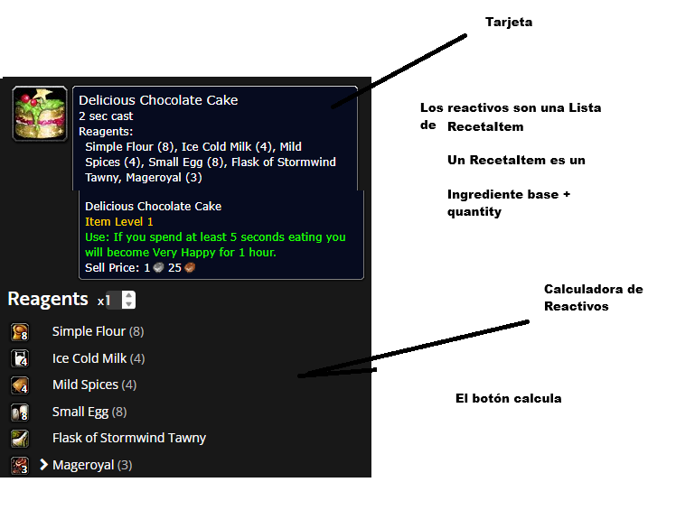

# 📜 Enunciado de la Actividad de Ampliación: "Azeroth Reagent Calculator"

**Objetivo:**
Desarrollar una aplicación en **Jetpack Compose** que permita calcular los materiales necesarios para fabricar recetas (crafting), aplicando los patrones de diseño, gestión de estado y listas eficientes vistos hasta la **UD06**.

**Requisitos Técnicos:**

1. **Arquitectura de Datos (Model):**
    * Debes crear una `data class Ingrediente` que contenga: nombre (`String`), rareza (para el color del texto) e **imagen local** (referencia a `R.drawable...`).
    * Debes crear una `data class RecetaItem` que vincule un `Ingrediente` con una `cantidadBase` (Int).
    * La `Receta` será una clase que contenga el nombre del objeto final, su icono y una `List<RecetaItem>`.

2. **Interfaz de Usuario (Compose):**
    * **Header:** Una "Tarjeta" superior que muestre el objeto a fabricar (ej. "Delicious Chocolate Cake").
    * **Controlador de Cantidad:** Un componente interactivo (Row con botones o TextField numérico) que permita al usuario elegir cuántos objetos quiere fabricar (x1, x5, x10...).
    * **Lista de Reactivos:** Debes usar obligatoriamente **`LazyColumn`** para renderizar la lista de materiales.
    * **Reactividad:** La lista de materiales debe actualizarse **automáticamente** al cambiar la cantidad a fabricar (multiplicando la cantidad base por el multiplicador seleccionado).

3. **Gestión de Estado (State Hoisting):**
    * La lógica de cálculo **NO** debe estar en la Vista (Composable).
    * Debes implementar un `ViewModel` (o patrón similar de elevación de estado) que exponga:
        * El estado actual de la receta (cantidades calculadas).
        * Eventos para modificar el multiplicador.

4. **Recursos:**
    * Descarga iconos simples (puedes usar assets de juegos open source o iconos genéricos de Material) e impórtalos en la carpeta `res/drawable`. No se permite el uso de librerías de carga de imágenes de internet.

